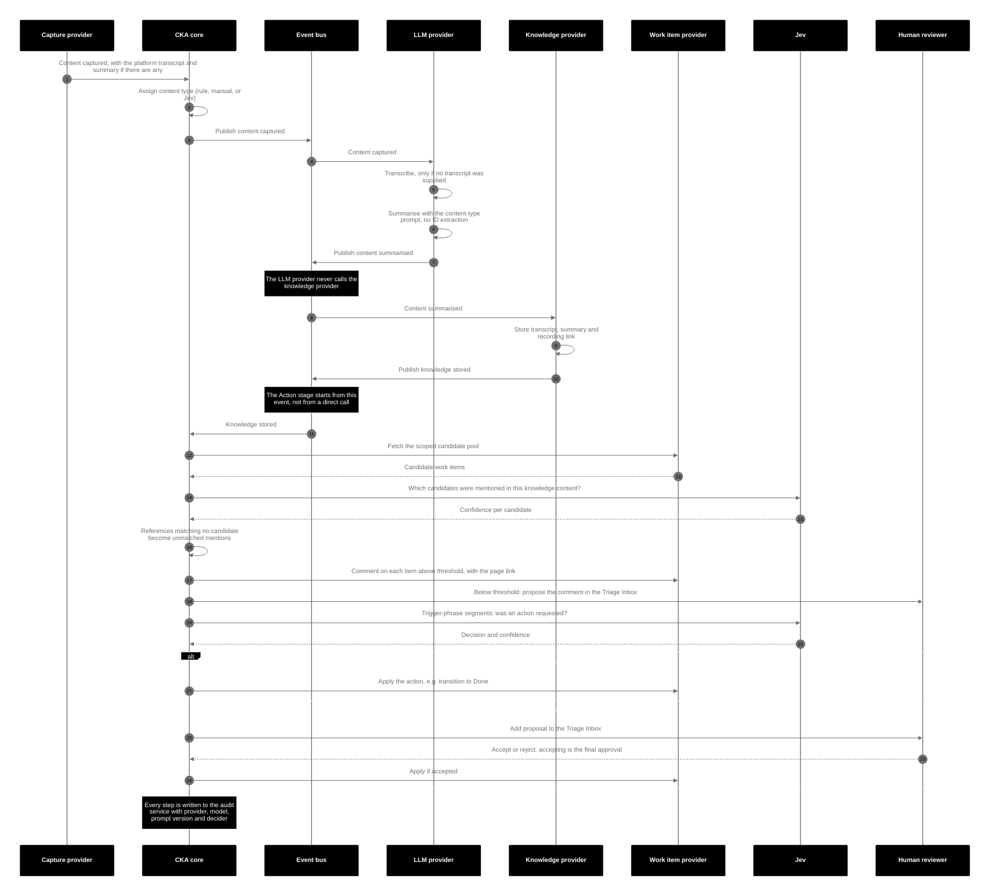
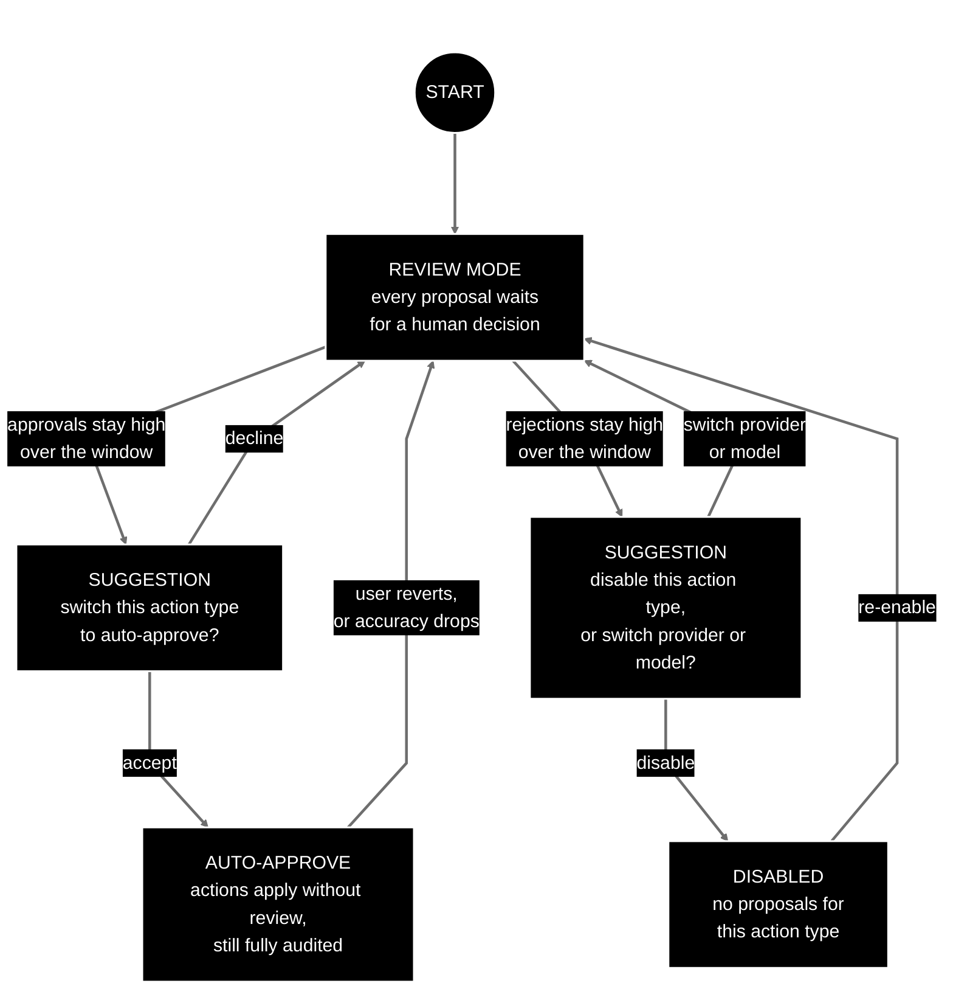
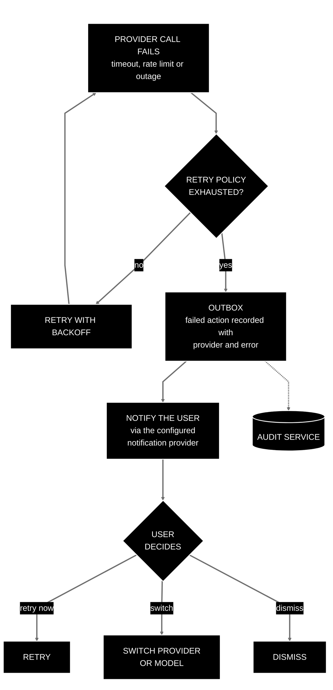

# Capture-Knowledge-Action

**Product Requirements Document — Draft v0.9.8 for review**

| | |
|---|---|
| Author | James Twisleton |
| Date | 18 September 2026 |
| Status | Draft — prototyped; seeking feedback on the product statement, user journeys and prototype before building |

*"Capture-Knowledge-Action" (CKA) is a working title. An initial search found no product using this exact name; a trademark and domain check is still to do.*

**▶ [See the product site](https://jamestwisleton.github.io/capture-knowledge-action/)** — the value proposition in plain language, linking through to a click-through demo of journeys J1, J4, J5 and J7 with fabricated data. No install required.

---

## How to review this document

This is a product statement first and a technical design second. The most valuable feedback is on Sections 1–6, kept together below: is the problem real, is the gap real, and do the user journeys make sense? Section 7 onwards describes the intended implementation, grounding the journeys in something buildable, and lives as separate linked pages in [`prd/`](prd/) — see [Further documentation](#further-documentation) at the end of this page for the full list. Diagrams are written in Mermaid (a plain-text format for diagrams that GitHub renders automatically). Every diagram carries its own black-background, white-text colour scheme and generous spacing, so it renders the same way in any viewer. Technical terms and acronyms are explained the first time they appear.

> [!WARNING]
> **DATA SENSITIVITY — READ BEFORE YOU SET ANYTHING UP**
>
> This product sends meeting transcripts and documents to whichever LLM providers you configure (LLM: large language model — the kind of AI behind tools like ChatGPT, Gemini and Claude), **and to whichever decision provider you configure** — Jev (TypeSafe AI) also receives transcript segments and candidate work item text in order to score them. Transcripts routinely contain names, project details, commercial information and occasionally conversations about people and personnel matters. **Before enabling any cloud LLM or decision provider, confirm that your organisation permits that data to be sent to that provider.** The expected setup is your organisation's own contracted LLM. Where that is not available, local self-hosted models are a first-class option and keep data inside your own infrastructure. This warning appears in the setup wizard, the documentation and the landing page, and must be acknowledged before an LLM or decision provider is enabled.

---

## 1. Product statement

Capture-Knowledge-Action is an open-source framework that turns meeting recordings and documentation into automated workflow actions — without locking you into any single vendor's AI, knowledge base, ticketing, messaging or cloud stack.

You assemble a stack from the providers you already have (or want): a meeting capture source; a knowledge store (an offline Markdown vault, an LLM-readable knowledge base, or a hosted platform such as Confluence); a work item tracker; one or more LLMs; an event bus (the messaging backbone that carries events between the parts of the system); and an audit database. CKA orchestrates the flow between them and lets you swap any one of them without rewriting the rest. It is deliberately conservative: it comments freely, but only changes state when a human has asked it to in plain words and a calibrated decision model is confident enough — and it earns the right to act autonomously by proving itself in review first.

**In one line:** Turn your knowledge into action automatically, with the tools you already know.

## 2. The gap

**The pattern.** Meetings-to-knowledge-to-action automation is already on sale — but only inside a single vendor's suite. Atlassian sells it across Jira and Confluence, Google across Meet and Workspace, Microsoft across Teams and 365. Each works well, right up to the edge of its own ecosystem, on the condition that every other tool you use is theirs too — and each is priced at a suite premium, upsold module by module.

**The observation.** The problem is not that the pipeline is hard to build; it is that buying it means buying a vendor. A stack that spans providers — one vendor's tracker, another's meeting platform, an offline wiki, a local model — is simply not supported by any of them, and wanting to swap one piece becomes a reason to re-buy an entire suite. **Composability across providers is the gap**, and it is what none of the suite vendors has an incentive to offer.

**What already exists.** Existing open-source meeting tools (for example Meetily and anarlog) have solved swappable LLM providers and local-first transcription well; their platform integrations — Confluence, Jira and equivalents — are thin or still on the roadmap. Separately, LLM gateways (LiteLLM, LangChain4j and others — a gateway is a single library or service that talks to many model providers through one interface) have fully solved provider-agnostic model access, routing and per-call cost tracking. Nobody has combined the two into a provider-agnostic *workflow* framework with a guided setup, swappable platform providers, and a decision layer for taking actions safely.

**The gap CKA fills:** swappable *platform* providers (capture, knowledge, work items, messaging, audit, cloud) + a safe, auditable action layer + an onboarding wizard — while consuming, not rebuilding, the LLM gateway layer.

## 3. What CKA is — and is not

### It is

- A provider-agnostic orchestration framework with three composable stages: **Capture**, **Knowledge**, **Action**.
- A safe action layer: passive mentions produce comments; state changes require a spoken trigger phrase, a calibrated decision, and (initially) human approval.
- An onboarding experience: a wizard that gets you from zero to a working pipeline, using OAuth (the standard "log in with Google / Microsoft" authorisation flow, which lets an app act on your behalf without ever seeing your password) rather than manual admin-console work wherever the platform allows it.
- A cost and provider dashboard that shows what each provider and model is costing you, and what the same work would cost elsewhere.
- **MCP-compatible across the whole stack**, through a published specification rather than a single server (MCP: Model Context Protocol, the open standard by which an AI agent discovers and calls external tools). Any AI agent can reach CKA's capabilities — triage, the audit trail, stored knowledge, provider health — and any provider can be satisfied by an MCP-conformant server rather than bespoke code. Composability extends past swappable providers: you are not locked into CKA's own process either. See [8.1](prd/08-architecture.md#81-overview).
- Deployable to your own cloud from a Git repository, with infrastructure-as-code (your cloud setup written as files that can be versioned and reproduced, rather than clicked together by hand) for each major cloud.
- Open source, and built to be extended.

### It is not

- **An LLM gateway.** CKA consumes LangChain4j / LiteLLM (or equivalent) for model routing, provider abstraction and per-call cost calculation rather than reimplementing them.
- **A meeting bot or transcription engine.** Transcription is delegated to the configured provider — and skipped entirely when the meeting platform already provides a transcript.
- **A replacement for your knowledge base or your work tracker.** These are two different stages, not one vendor. On the Knowledge side, CKA writes to whatever store you choose — an offline wiki or a knowledge base built to be read by LLMs is a first-class option (see [7.3](prd/07-core-concepts-and-domain-model.md#73-the-offline-knowledge-store)), alongside Confluence, Notion and the like. On the Action side, it comments on and updates work items in Jira, Azure DevOps, GitHub Issues or anything else. It writes to both; it replaces neither.
- **Autonomous by default.** It becomes autonomous, per action type, only once you allow it to.

## 4. Who it is for

- **Engineering and delivery teams** who want meetings to become searchable knowledge and tracked work automatically, on the tooling they already have.
- **Platform and enablement teams** who need to run this on their own cloud, with their own contracted LLM, under their own data policies.
- **Integrators** who work with organisations that have different stacks and want to add this capability without rebuilding it for each one.
- **Open-source developers** who want to add a provider for their tool of choice.

## 5. Guiding principles

1. **Everything meaningful is a provider.** Capture, knowledge, work items, LLMs, decision models, code hosting, event bus, audit storage, notifications and cloud are all swappable behind capability-based interfaces. Categories are named by capability ("work item provider"), never by vendor ("Jira provider").
2. **Don't reinvent the wheel.** At every stage we check whether something already exists; where it does (LLM gateways, transcription, design tooling) we consume it. This is a standing rule for the project, not a one-off check.
3. **Conservative by design.** The system pushes precision back onto the user rather than trying to be clever about inferring intent. Low-risk actions are automatic; anything that changes state needs an explicit, deliberate instruction.
4. **Earn trust, don't assume it.** Mutating actions start in human review. The system measures its own accuracy against human decisions and offers to graduate to auto-approval — and, just as readily, offers to switch provider or switch itself off when it keeps getting things wrong.
5. **Honest about limitations.** Known weaknesses (audio reliability, provider semantic differences, untested deploy paths, ballpark costs) are documented and surfaced in the user interface (UI), not hidden.
6. **Sensible defaults, minimal configuration.** Setup should be easy; every default should be reasonable; every default should be overridable.
7. **Auditable.** Every action, decision, approval and failure is recorded in one authoritative place that does not depend on any third-party platform being available.

## 6. User journeys

J1 is the golden path. J2 and J3 are independently valid entry points: the stages are composable, not a fixed pipeline. J4–J7 are the supporting journeys that make J1 safe and usable.

### J1 — Golden path: Meeting → Knowledge → Actions

**Example organisation (illustrative):** Microsoft Teams for meetings, an organisation-contracted OpenAI for LLM work, Confluence as the knowledge store, Jira for work items. Any other combination works the same way. (The public demo may deliberately use a different combination — for example an offline Markdown vault as the knowledge store and GitHub Issues as the work item provider — to demonstrate that the framework is genuinely agnostic.)

1. A meeting happens on Teams and is recorded. The recording lands where the capture provider can see it (see J4).
2. The capture provider raises a "content captured" event, attaching the platform's own transcript — and, where the platform produces one, the platform's own summary — if it produced them. CKA assigns the item a content type (see [7.6](prd/07-core-concepts-and-domain-model.md#76-content-types-and-summary-prompts)) — for a meeting, its meeting type.
3. The LLM provider consumes that event. If the meeting platform already supplied a transcript — Google Meet and Microsoft Teams both can — CKA uses it and skips transcription; otherwise the LLM provider transcribes the recording. It then summarises using the prompt for its content type: a stand-up is summarised very differently from a ticket refinement session. Where the platform supplied its own summary as well as a transcript, both are used together as input. **Summarising is the whole of the LLM's job here — it never extracts work item IDs** (see step 8).
4. The LLM provider publishes a **"content summarised"** event and its work is done. It does not write to the knowledge provider, or call it, or know which one is configured.
5. The knowledge provider consumes that event and writes the transcript, summary and a link to the recording to its store (Confluence in this example), where the organisation's search and AI tooling can index them.
6. The write completes and the knowledge provider publishes a **"knowledge stored"** event. This is the seam between the Knowledge and Action stages: everything from here on is triggered by that event, never called directly by the orchestrator or by the LLM step. That is what lets either stage be swapped, or run on its own (J2, J3), or be driven by knowledge written some other way.
7. The Action stage consumes the event. The work item provider supplies a **scoped candidate pool** — for example, items on the team's board modified in the last two weeks (configurable; see [7.5](prd/07-core-concepts-and-domain-model.md#75-candidate-pool)).
8. Jev evaluates the stored knowledge content — transcript and summary together — against the candidate pool and returns a per-item confidence that each was mentioned. This is one step, not two: there is no separate ID-extraction pass to keep in sync with it, which is exactly what makes it tolerant of mistranscribed item IDs (an item's reference number, such as PROJ-1234) where brittle exact-text matching is not. Three outcomes follow, and nothing is discarded: items at or above the mention threshold (default 90%, configurable) are treated as mentioned; items below it become **proposed comments** in the Triage Inbox for a human to confirm; and a reference matching no candidate in the pool at all is recorded as an **unmatched mention**, written to the audit trail and surfaced in the front end.
9. For every mentioned item, CKA posts a comment: "This item was discussed in [meeting] on [date] — [link to the knowledge page]". No trigger phrase is needed; commenting is a low-risk action.
10. Where a participant used the team's trigger phrase with an explicit item ID ("For the rubber duck: please close PROJ-1234"), that segment is passed to Jev to classify whether a mutating action was requested against the candidate that mention detection matched, and with what confidence.
11. If the per-action-type trust setting allows auto-approval and confidence clears the threshold, the action is applied (for example, the item is transitioned to Done). Otherwise it is placed in the Triage Inbox for a human to accept or reject. Since every mutating action type starts in review, in practice this means every state change goes past a human until that action type has earned auto-approval (J5). **Accepting in the Triage Inbox is the final approval — there is no second confirmation dialog after it.**
12. Every step — capture, transcription, storage, detection (including unmatched mentions), comment, decision, approval, action — is written to the audit service, together with which provider and model performed it and which prompt version produced the summary. The full traceable record from the original recording to whatever was applied is the **action decision chain** (see [7.8](prd/07-core-concepts-and-domain-model.md#78-audit-record)).

### J2 — Capture → Knowledge only

A team just wants every meeting recording transcribed, summarised and stored in their knowledge provider so it becomes searchable. No work item integration, no Jev, no actions. Steps 1–6 of J1, then stop: the "knowledge stored" event is still published, and with no Action stage configured nothing consumes it. Because the knowledge provider can be an entirely offline Markdown vault (see 7.3), this journey can run with no hosted service at all beyond the meeting platform. This is a complete and valid configuration.

### J3 — Knowledge → Action only

A team already has knowledge written down — hand-written meeting notes, decision records, existing wiki pages — and wants work item actions driven from it. Documents are captured directly from the knowledge provider or uploaded, given a document content type (see [7.6](prd/07-core-concepts-and-domain-model.md#76-content-types-and-summary-prompts)), and then steps 7–12 of J1 apply. No meeting recording is involved. Because the Action stage is driven entirely by the "knowledge stored" event, this journey needs no special-casing: anything that writes knowledge and publishes the event starts it.

### J4 — Setup wizard

The wizard takes a user from an empty install to a running pipeline with as little manual admin work as possible.

> [!NOTE]
> **MVP:** the web wizard described here is the target design and is **deferred**. For the MVP it is replaced by a terminal wizard: `./setup.sh` checks prerequisites (Docker and so on), asks for each credential with inline instructions and the required scopes, and writes a `.env` file; `./start.sh` runs Docker Compose. There is no separate doctor script — requirements are listed in the README. See [`prd/mvp-tickets.md`](prd/mvp-tickets.md) T20.

1. **Choose providers per category.** Meeting capture, knowledge (an offline vault or a hosted platform), work items, LLM (cloud or local), decision model, event bus, audit store, notifications, and optionally code hosting. Each category lists the available implementations.
2. **Authorise.** "Log in with Google / Microsoft / Atlassian / GitHub". CKA requests only the scopes (permissions) it needs and obtains tokens so it can perform setup on the user's behalf. *In the MVP the user brings their own Google OAuth app, **published** rather than left in "Testing" status — an unpublished app's refresh tokens expire after 7 days. The client ID and secret go in `.env`; `./setup.sh` runs the consent flow once and stores the resulting refresh token, from which the core mints access tokens and refreshes them silently. The user creates and publishes the OAuth app and creates a GitHub personal access token by following README instructions, rather than the wizard doing it on their behalf. The public demo uses the author's own published OAuth app.*
3. **Capture set up on your behalf.** Depending on the platform: create or nominate a service account that creates or is invited to meetings so recordings land in a predictable place; or watch a folder (for example a OneDrive or Google Drive folder) for new recordings — folder-based capture works by **polling** the folder on an interval, since push notifications need a publicly reachable webhook. Where the platform's API (application programming interface — the way one piece of software talks to another) cannot do this, the wizard generates precise step-by-step instructions for the human to follow instead. The wizard also detects whether the platform supplies its own transcripts.
4. **Content types and summary prompts.** Review the default prompt for each starting meeting type (stand-up, ticket refinement, sprint planning, retrospective) and the general fallback; edit them, or add your own meeting and document types. Set the rules that assign a type to captured content (see [7.6](prd/07-core-concepts-and-domain-model.md#76-content-types-and-summary-prompts)).
5. **Team trigger phrase.** Set the canonical phrase — a "wake word" for actions. Guidance shown in the UI: choose something distinctive that will survive imperfect audio, and always say the item ID in the same sentence. *In the MVP the phrase is set by env var, asked for by `./setup.sh`.*
6. **Candidate pool scope.** Current sprint / team board items modified in the last N days / all open items in the project. The wizard explains that items outside the pool will not be detected.
7. **Trust defaults.** Accept sensible per-action-type defaults (comments automatic; transitions and closures in review) or tune them.
8. **Audit store.** SQLite (a zero-setup, single-file database) is configured by default with no extra work; any SQL database can be substituted (SQL is the standard relational database language — Postgres, MySQL and SQLite all speak it).
9. **Test run.** Capture a short test meeting or upload a document and watch it flow through to the Triage Inbox.

Throughout, a **connection tester** shows the live status of each configured provider — every provider exposes a health check for exactly this purpose. It is the one part of the wizard built in the MVP: the front end's provider health dashboard is written as reusable scaffolding that the web wizard later adopts, rather than as throwaway UI.

The data-sensitivity warning is shown at the LLM and decision provider steps and must be acknowledged.

```mermaid
---
title: J4 setup wizard
---
%%{init: {"theme":"base","themeVariables":{"background":"#000000","fontSize":"20px","primaryColor":"#000000","primaryTextColor":"#ffffff","primaryBorderColor":"#ffffff","secondaryColor":"#000000","secondaryTextColor":"#ffffff","secondaryBorderColor":"#ffffff","tertiaryColor":"#000000","tertiaryTextColor":"#ffffff","tertiaryBorderColor":"#ffffff","lineColor":"#6e6e6e","textColor":"#ffffff","mainBkg":"#000000","nodeBorder":"#ffffff","nodeTextColor":"#ffffff","clusterBkg":"#000000","clusterBorder":"#ffffff","titleColor":"#6e6e6e","edgeLabelBackground":"#000000"},"flowchart":{"nodeSpacing":70,"rankSpacing":90,"padding":24,"curve":"linear"},"themeCSS":"svg{background:#000000 !important;}"}}%%
flowchart TB
  S1["1 · CHOOSE PROVIDERS<br/>one implementation per category"] ==> S2["2 · AUTHORISE<br/>log in with Google, Microsoft,<br/>Atlassian or GitHub via OAuth"]
  S2 ==> S3["3 · CAPTURE SET UP FOR YOU<br/>service account or folder watch;<br/>detects platform transcripts"]
  S3 ==> S4["4 · CONTENT TYPES AND PROMPTS<br/>review the starting set,<br/>edit, or add your own"]
  S4 ==> S5["5 · TRIGGER PHRASE<br/>the team wake word for actions"]
  S5 ==> S6["6 · CANDIDATE POOL<br/>sprint, recent items, or all open"]
  S6 ==> S7["7 · TRUST DEFAULTS<br/>comments automatic,<br/>state changes in review"]
  S7 ==> S8["8 · AUDIT STORE<br/>SQLite by default,<br/>any SQL database"]
  S8 ==> S9["9 · TEST RUN<br/>one capture, end to end"]
  classDef default fill:#000000,stroke:#ffffff,stroke-width:2px,color:#ffffff
  linkStyle default stroke:#6e6e6e,stroke-width:3px
```

### J5 — Triage Inbox and the trust ramp

1. Two kinds of proposal appear in the **Triage Inbox**. Proposed mutating actions: "Jev proposes closing PROJ-1234 (confidence 94%) based on [transcript excerpt] — Accept / Reject". And proposed comments, where a mention fell below the confidence threshold: "Jev thinks PROJ-5678 may have been discussed (confidence 71%) — Accept / Reject". Every proposal shows its confidence and which provider and model produced it, so a bad provider is visible and attributable rather than "the app got it wrong".
2. The user accepts or rejects — individually, or with an **accept all** for the whole list. Accepting is the final approval; there is no second confirmation dialog. Both outcomes are written to the action decision chain and feed the trust score for that action type.
3. When the approval rate for an action type stays high over a window (for example 100% over two weeks), CKA suggests: "You've accepted every proposed closure for two weeks. Switch closures to auto-approve?" The audit trail continues either way.
4. The converse is equally important. When the rejection rate stays high, CKA suggests: "You've rejected most proposed closures this month. This is costing you money in LLM calls. Disable this action type, or switch the provider or model making these decisions?"
5. Trust is tracked **per action type, never globally**: a team can fully trust "comment" while never auto-approving "close".

*This journey is in the MVP in full: individual accept, individual reject, accept all, both outcomes recorded in the audit chain and visible in the front end, and the suggestion banners at steps 3 and 4 once there is enough accept/reject history for an action type. The demo recording deliberately contains a wrong ticket number so that a misclassification is proposed and the reject path is shown, not only the happy path.*

### J6 — Failure handling

1. A provider call fails (timeout, rate limit, outage, or a rejected credential) and exhausts its retry policy.
2. The affected action is recorded in the **Outbox** as failed, with the provider and error, and is shown as a **distinct failed state** — alongside pending and done — in the activity log and the front end. It is written to the action decision chain with the provider and the error.
3. The user is notified through their configured notification provider (email by default).
4. From the Outbox the user can retry, switch provider or model, or dismiss. Nothing stalls silently, and nothing is lost.

*In the MVP: the failed state, and all three of retry, switch provider and dismiss, are built. Notification delivery (step 3 — email, Slack) is **not** — the visible failed state in the front end is the notification. The demo shows this by setting the GitHub token to nonsense.*

### J7 — Cost and provider dashboard

1. The dashboard shows spend per provider, per model, per use case (transcription, summarisation, mention detection, action decisions) and per content type.
2. Each figure shows a **predicted** cost (token estimates against current pricing, largely supplied by the LLM gateway layer) and, where the user has linked their provider billing, the **actual** metered cost — so the accuracy of the prediction is itself visible over time.
3. A "what if" comparison estimates what the same workload would have cost on other configured providers or models. All figures are ballpark and labelled as such: token usage is hard to predict precisely.
4. Costs are displayed in a configurable currency (GBP — pounds sterling — by default in the demo).

*Deferred from the MVP. The MVP does record the provider and model used for every call, which is the data this dashboard is built on later.*

## Further documentation

Sections 1–6 above are the product statement and user journeys — the primary review surface. Section 7 onwards describes the intended implementation and lives as separate pages in [`prd/`](prd/), so this document stays focused:

| Section | Page | Covers |
|---|---|---|
| 7 | [Core concepts and domain model](prd/07-core-concepts-and-domain-model.md) | Stages, providers, the offline knowledge store, trigger phrase, candidate pool, content types |
| 8 | [Architecture](prd/08-architecture.md) | System overview, backend and front end, the LLM's actual jobs |
| 9 | [Trust, safety and audit](prd/09-trust-safety-and-audit.md) | The gate model, trust scores, audit |
| 10 | [Extensibility](prd/10-extensibility.md) | New providers, new provider types, vendor API versioning |
| 11 | [Deployment and portability](prd/11-deployment-and-portability.md) | Local run, Terraform per cloud, v1 honesty |
| 12 | [Known limitations and honest tradeoffs](prd/12-known-limitations.md) | Documented weaknesses and the stance taken on each |
| 13 | [Open source and business model](prd/13-open-source-and-business-model.md) | Licence, patents, open core |
| 14 | [Landing page](prd/14-landing-page.md) | The GitHub Pages product front door |
| 15 | [Decision log](prd/15-decision-log.md) | How we got here, in order |
| 16–17 | [Open questions and next steps](prd/16-17-open-questions-and-next-steps.md) | What's still unresolved, what happens next |
| — | [MVP ticket breakdown](prd/mvp-tickets.md) | The 22 tickets of the MVP, in order, with acceptance criteria — tracked as epic [#1](https://github.com/JamesTwisleton/capture-knowledge-action/issues/1). Delivery planning rather than a PRD section |
| — | [MVP demo script](prd/demo-script.md) | The script for the demo recording, doubling as the MVP test plan (T21). Delivery material rather than a PRD section |
| — | [Changelog](prd/changelog.md) | Version history of this document |

## License

Copyright 2026 James Twisleton.

Licensed under the **Apache License, Version 2.0** — see [`LICENSE`](LICENSE) for the full text. In plain terms: you may use, modify and redistribute this, including inside paid closed-source products, provided you keep the copyright notice and state what you changed. Apache 2.0 also carries a patent grant from every contributor, which protects people who adopt the project. [Section 13](prd/13-open-source-and-business-model.md) explains the reasoning and what "open core" means here.

The `LICENSE` file is the canonical Apache 2.0 text, unmodified — `md5 3b83ef96387f14655fc854ddc3c6bd57`.
