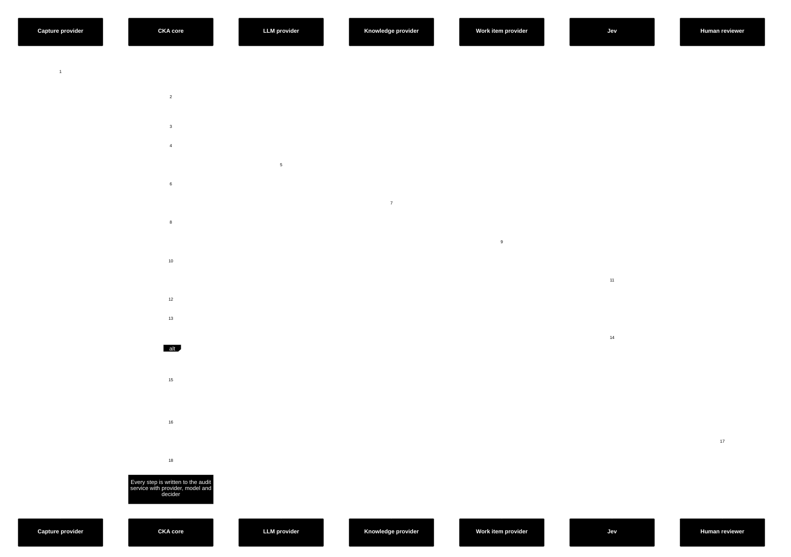
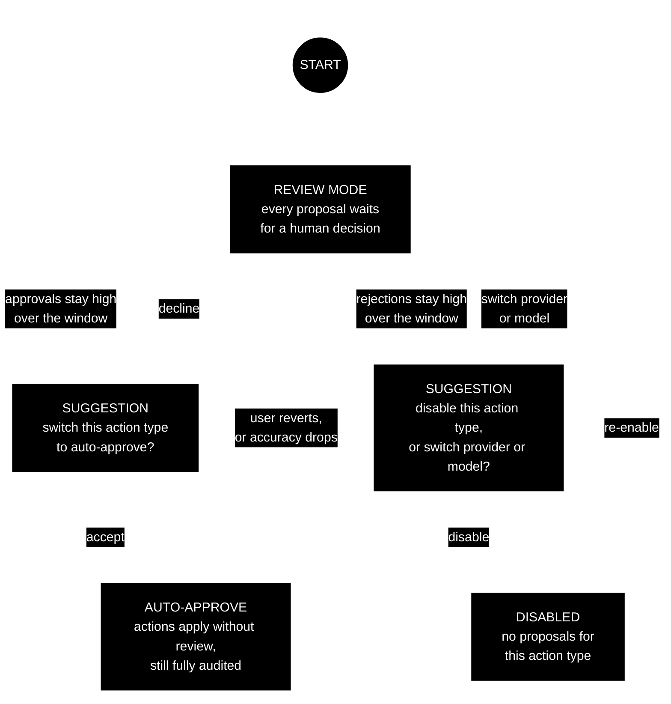
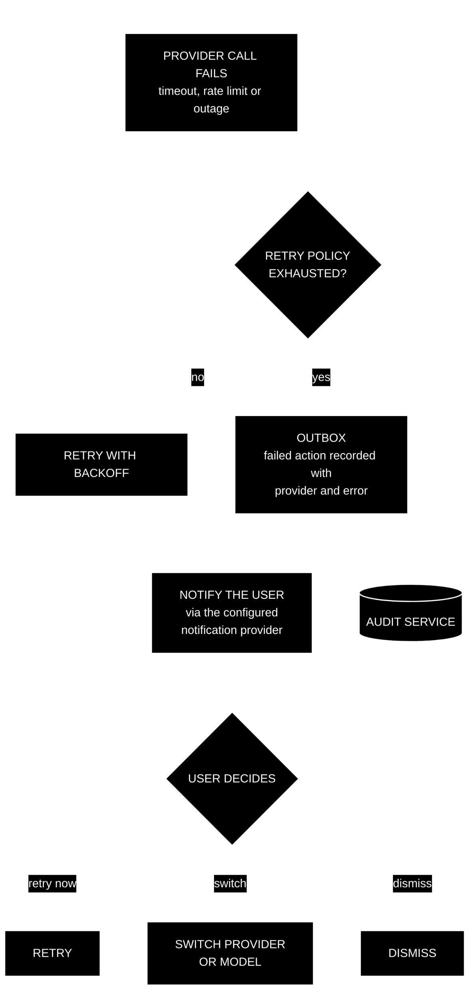
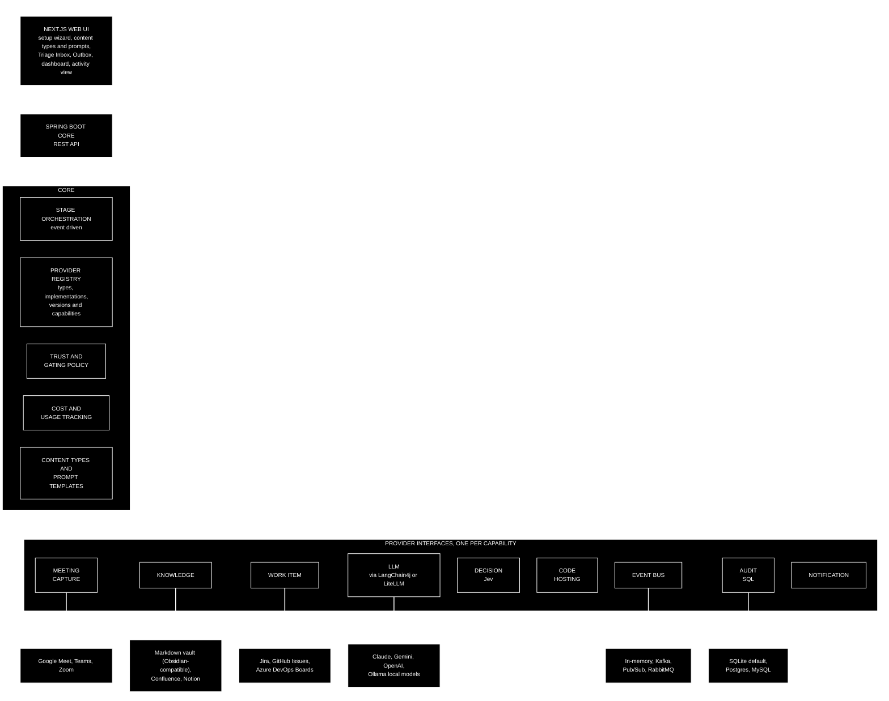
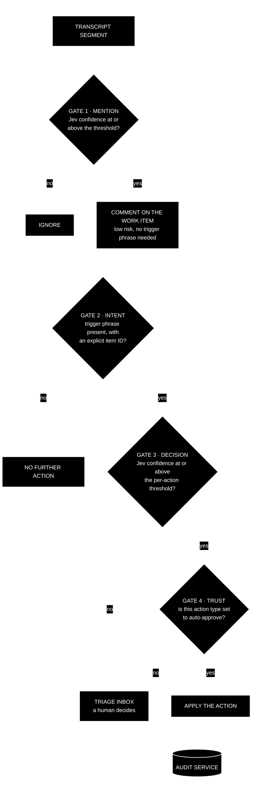

# Capture-Knowledge-Action

**Product Requirements Document — Draft v0.5 for review**

| | |
|---|---|
| Author | James Twisleton |
| Date | 18 September 2026 |
| Status | Draft — seeking feedback on the product statement and user journeys before prototyping |

*"Capture-Knowledge-Action" (CKA) is a working title. An initial search found no product using this exact name; a trademark and domain check is still to do.*

---

## How to review this document

This is a product statement first and a technical design second. The most valuable feedback is on Sections 1–6: is the problem real, is the gap real, and do the user journeys make sense? Section 7 onwards describes the intended implementation and is included so the journeys are grounded in something buildable. Diagrams are written in Mermaid (a plain-text format for diagrams that GitHub renders automatically). Every diagram carries its own black-background, white-text colour scheme and generous spacing, so it renders the same way in any viewer. Technical terms and acronyms are explained the first time they appear.

> [!WARNING]
> **DATA SENSITIVITY — READ BEFORE YOU SET ANYTHING UP**
>
> This product sends meeting transcripts and documents to whichever LLM providers you configure (LLM: large language model — the kind of AI behind tools like ChatGPT, Gemini and Claude). Transcripts routinely contain names, project details, commercial information and occasionally conversations about people and personnel matters. **Before enabling any cloud LLM provider, confirm that your organisation permits that data to be sent to that provider.** The expected setup is your organisation's own contracted LLM. Where that is not available, local self-hosted models are a first-class option and keep data inside your own infrastructure. This warning appears in the setup wizard, the documentation and the landing page, and must be acknowledged before an LLM provider is enabled.

---

## 1. Product statement

Capture-Knowledge-Action is an open-source framework that turns meeting recordings and documentation into automated workflow actions — without locking you into any single vendor's AI, knowledge base, ticketing, messaging or cloud stack.

You assemble a stack from the providers you already have (or want): a meeting capture source; a knowledge store (an offline Markdown vault, an LLM-readable knowledge base, or a hosted platform such as Confluence); a work item tracker; one or more LLMs; an event bus (the messaging backbone that carries events between the parts of the system); and an audit database. CKA orchestrates the flow between them and lets you swap any one of them without rewriting the rest. It is deliberately conservative: it comments freely, but only changes state when a human has asked it to in plain words and a calibrated decision model is confident enough — and it earns the right to act autonomously by proving itself in review first.

**In one line:** assemble a meeting-capture, knowledge and workflow-action stack from any providers, at the lowest achievable cost, with no vendor commitment — and with local models and an offline knowledge base as first-class citizens.

## 2. The gap

**The pattern.** Organisations everywhere are building the same pipeline: meeting recordings → an LLM summariser → a CI/CD pipeline (continuous integration / continuous delivery — the automation that builds and ships software) → a wiki or documentation store, so that their search or AI assistant can index and answer questions about every meeting. Each version works. Each is also entirely vendor-specific: it assumes one meeting platform, one LLM, one pipeline tool, one knowledge store and one work tracker, and needs rewriting for any organisation using a different combination.

**The observation.** The problem is not that the pipeline is hard; it is that every version of it is bespoke, locked in, unreusable and unportable — and it is being rebuilt from scratch, over and over, with each organisation's vendor tools bolted on.

**What already exists.** Existing open-source meeting tools (for example Meetily and anarlog) have solved swappable LLM providers and local-first transcription well; their platform integrations — Confluence, Jira and equivalents — are thin or still on the roadmap. Separately, LLM gateways (LiteLLM, LangChain4j and others — a gateway is a single library or service that talks to many model providers through one interface) have fully solved provider-agnostic model access, routing and per-call cost tracking. Nobody has combined the two into a provider-agnostic *workflow* framework with a guided setup, swappable platform providers, and a decision layer for taking actions safely.

**The gap CKA fills:** swappable *platform* providers (capture, knowledge, work items, messaging, audit, cloud) + a safe, auditable action layer + an onboarding wizard — while consuming, not rebuilding, the LLM gateway layer.

## 3. What CKA is — and is not

### It is

- A provider-agnostic orchestration framework with three composable stages: **Capture**, **Knowledge**, **Action**.
- A safe action layer: passive mentions produce comments; state changes require a spoken trigger phrase, a calibrated decision, and (initially) human approval.
- An onboarding experience: a wizard that gets you from zero to a working pipeline, using OAuth (the standard "log in with Google / Microsoft" authorisation flow, which lets an app act on your behalf without ever seeing your password) rather than manual admin-console work wherever the platform allows it.
- A cost and provider dashboard that shows what each provider and model is costing you, and what the same work would cost elsewhere.
- Deployable to your own cloud from a Git repository, with infrastructure-as-code (your cloud setup written as files that can be versioned and reproduced, rather than clicked together by hand) for each major cloud.
- Open source, and built to be extended.

### It is not

- **An LLM gateway.** CKA consumes LangChain4j / LiteLLM (or equivalent) for model routing, provider abstraction and per-call cost calculation rather than reimplementing them.
- **A meeting bot or transcription engine.** Transcription is delegated to the configured provider — and skipped entirely when the meeting platform already provides a transcript.
- **A replacement for your knowledge base or your work tracker.** These are two different stages, not one vendor. On the Knowledge side, CKA writes to whatever store you choose — an offline wiki or a knowledge base built to be read by LLMs is a first-class option (see 7.3), alongside Confluence, Notion and the like. On the Action side, it comments on and updates work items in Jira, Azure DevOps, GitHub Issues or anything else. It writes to both; it replaces neither.
- **Autonomous by default.** It becomes autonomous, per action type, only once you allow it to.

## 4. Who it is for

- **Engineering and delivery teams** who want meetings to become searchable knowledge and tracked work automatically, on the tooling they already have.
- **Platform and enablement teams** who need to run this on their own cloud, with their own contracted LLM, under their own data policies.
- **Integrators** who work with organisations that have different stacks and want to add this capability without rebuilding it for each one.
- **Open-source developers** who want to add a provider for their tool of choice.

## 5. Guiding principles

1. **Everything meaningful is a provider.** Capture, knowledge, work items, LLMs, decision models, code hosting, event bus, audit storage, notifications and cloud are all swappable behind capability-based interfaces. Categories are named by capability ("work item provider"), never by vendor ("Jira provider").
2. **Don't reinvent the wheel.** At every stage we check whether something already exists; where it does (LLM gateways, transcription, design tooling) we consume it. This is a standing rule for the project, not a one-off check.
3. **Conservative by design.** The system pushes precision back onto the user rather than trying to be clever about inferring intent. Low-risk actions are automatic; anything that changes state needs an explicit, deliberate instruction.
4. **Earn trust, don't assume it.** Mutating actions start in human review. The system measures its own accuracy against human decisions and offers to graduate to auto-approval — and, just as readily, offers to switch provider or switch itself off when it keeps getting things wrong.
5. **Honest about limitations.** Known weaknesses (audio reliability, provider semantic differences, untested deploy paths, ballpark costs) are documented and surfaced in the user interface (UI), not hidden.
6. **Sensible defaults, minimal configuration.** Setup should be easy; every default should be reasonable; every default should be overridable.
7. **Auditable.** Every action, decision, approval and failure is recorded in one authoritative place that does not depend on any third-party platform being available.

## 6. User journeys

J1 is the golden path. J2 and J3 are independently valid entry points: the stages are composable, not a fixed pipeline. J4–J7 are the supporting journeys that make J1 safe and usable.

### J1 — Golden path: Meeting → Knowledge → Actions

**Example organisation (illustrative):** Microsoft Teams for meetings, an organisation-contracted OpenAI for LLM work, Confluence as the knowledge store, Jira for work items. Any other combination works the same way. (The public demo may deliberately use a different combination — for example an offline Markdown vault as the knowledge store and GitHub Issues as the work item provider — to demonstrate that the framework is genuinely agnostic.)

1. A meeting happens on Teams and is recorded. The recording lands where the capture provider can see it (see J4).
2. The capture provider raises a "content captured" event, attaching the platform's own transcript if it produced one. CKA assigns the item a content type (see 7.6) — for a meeting, its meeting type.
3. If the meeting platform already supplied a transcript — Google Meet and Microsoft Teams both can — CKA uses it and skips transcription; otherwise the LLM provider transcribes the recording. The LLM provider then summarises the transcript using the prompt for its content type: a stand-up is summarised very differently from a ticket refinement session.
4. Transcript, summary and a link to the recording are written to the knowledge provider (Confluence in this example), where the organisation's search and AI tooling can index them.
5. The work item provider supplies a **scoped candidate pool** — for example, items on the team's board modified in the last two weeks (configurable; see 7.5).
6. Jev evaluates the transcript against the candidate pool and returns a per-item confidence that each was mentioned. Items above the mention threshold (default 90%, configurable) are treated as mentioned. This replaces brittle exact-text matching and tolerates mistranscribed item IDs (an item's reference number, such as PROJ-1234).
7. For every mentioned item, CKA posts a comment: "This item was discussed in [meeting] on [date] — [link to the knowledge page]". No trigger phrase is needed; commenting is a low-risk action.
8. Where a participant used the team's trigger phrase with an explicit item ID ("For the rubber duck: please close PROJ-1234"), that segment is passed to Jev to classify whether a mutating action was requested, and with what confidence.
9. If the per-action-type trust setting allows auto-approval and confidence clears the threshold, the action is applied (for example, the item is transitioned to Done). Otherwise it is placed in the Triage Inbox for a human to approve or reject.
10. Every step — capture, transcription, storage, detection, comment, decision, approval, action — is written to the audit service, together with which provider and model performed it.

### J2 — Capture → Knowledge only

A team just wants every meeting recording transcribed, summarised and stored in their knowledge provider so it becomes searchable. No work item integration, no Jev, no actions. Steps 1–4 of J1, then stop. Because the knowledge provider can be an entirely offline Markdown vault (see 7.3), this journey can run with no hosted service at all beyond the meeting platform. This is a complete and valid configuration.

### J3 — Knowledge → Action only

A team already has knowledge written down — hand-written meeting notes, decision records, existing wiki pages — and wants work item actions driven from it. Documents are captured directly from the knowledge provider or uploaded, given a document content type (see 7.6), and then steps 5–10 of J1 apply. No meeting recording is involved.

### J4 — Setup wizard

The wizard takes a user from an empty install to a running pipeline with as little manual admin work as possible.

1. **Choose providers per category.** Meeting capture, knowledge (an offline vault or a hosted platform), work items, LLM (cloud or local), decision model, event bus, audit store, notifications, and optionally code hosting. Each category lists the available implementations.
2. **Authorise.** "Log in with Google / Microsoft / Atlassian / GitHub". CKA requests only the scopes (permissions) it needs and obtains tokens so it can perform setup on the user's behalf.
3. **Capture set up on your behalf.** Depending on the platform: create or nominate a service account that creates or is invited to meetings so recordings land in a predictable place; or watch a folder (for example a OneDrive or Google Drive folder) for new recordings. Where the platform's API (application programming interface — the way one piece of software talks to another) cannot do this, the wizard generates precise step-by-step instructions for the human to follow instead. The wizard also detects whether the platform supplies its own transcripts.
4. **Content types and summary prompts.** Review the default prompt for each starting meeting type (stand-up, ticket refinement, sprint planning, retrospective) and the general fallback; edit them, or add your own meeting and document types. Set the rules that assign a type to captured content (see 7.6).
5. **Team trigger phrase.** Set the canonical phrase — a "wake word" for actions. Guidance shown in the UI: choose something distinctive that will survive imperfect audio, and always say the item ID in the same sentence.
6. **Candidate pool scope.** Current sprint / team board items modified in the last N days / all open items in the project. The wizard explains that items outside the pool will not be detected.
7. **Trust defaults.** Accept sensible per-action-type defaults (comments automatic; transitions and closures in review) or tune them.
8. **Audit store.** SQLite (a zero-setup, single-file database) is configured by default with no extra work; any SQL database can be substituted (SQL is the standard relational database language — Postgres, MySQL and SQLite all speak it).
9. **Test run.** Capture a short test meeting or upload a document and watch it flow through to the Triage Inbox.

The data-sensitivity warning is shown at the LLM provider step and must be acknowledged.

### J5 — Triage Inbox and the trust ramp

1. Proposed mutating actions appear in the **Triage Inbox**: "Jev proposes closing PROJ-1234 (confidence 94%) based on [transcript excerpt] — Approve / Reject". Every proposal shows which provider and model produced it, so a bad provider is visible and attributable rather than "the app got it wrong".
2. The user approves or rejects. Both outcomes are audited and feed the trust score for that action type.
3. When the approval rate for an action type stays high over a window (for example 100% over two weeks), CKA suggests: "You've accepted every proposed closure for two weeks. Switch closures to auto-approve?" The audit trail continues either way.
4. The converse is equally important. When the rejection rate stays high, CKA suggests: "You've rejected most proposed closures this month. This is costing you money in LLM calls. Disable this action type, or switch the provider or model making these decisions?"
5. Trust is tracked **per action type, never globally**: a team can fully trust "comment" while never auto-approving "close".

### J6 — Failure handling

1. A provider call fails (timeout, rate limit, outage) and exhausts its retry policy.
2. The affected action is recorded in the **Outbox** as failed, with the provider and error.
3. The user is notified through their configured notification provider (email by default).
4. From the Outbox the user can retry, switch provider or model, or dismiss. Nothing stalls silently, and nothing is lost.

### J7 — Cost and provider dashboard

1. The dashboard shows spend per provider, per model, per use case (transcription, summarisation, mention detection, action decisions) and per content type.
2. Each figure shows a **predicted** cost (token estimates against current pricing, largely supplied by the LLM gateway layer) and, where the user has linked their provider billing, the **actual** metered cost — so the accuracy of the prediction is itself visible over time.
3. A "what if" comparison estimates what the same workload would have cost on other configured providers or models. All figures are ballpark and labelled as such: token usage is hard to predict precisely.
4. Costs are displayed in a configurable currency (GBP — pounds sterling — by default in the demo).

## 7. Core concepts and domain model

### 7.1 Stages

Capture, Knowledge and Action are independently invokable stages connected by events. Each stage produces a normalised output the next stage can consume regardless of what fed it: Capture produces "content + text, with a content type" (whether from a recording with or without a platform transcript, or from a document); Knowledge produces "stored, linkable knowledge"; Action produces "proposed or applied actions". This is what makes J1, J2 and J3 all valid without special-casing.

```mermaid
---
title: The three stages, and how content flows through them
---
%%{init: {"theme":"base","themeVariables":{"background":"#000000","fontSize":"20px","fontFamily":"Helvetica, Arial, sans-serif","primaryColor":"#000000","primaryTextColor":"#ffffff","primaryBorderColor":"#ffffff","secondaryColor":"#000000","secondaryTextColor":"#ffffff","secondaryBorderColor":"#ffffff","tertiaryColor":"#000000","tertiaryTextColor":"#ffffff","tertiaryBorderColor":"#ffffff","lineColor":"#ffffff","textColor":"#ffffff","mainBkg":"#000000","nodeBorder":"#ffffff","nodeTextColor":"#ffffff","clusterBkg":"#000000","clusterBorder":"#ffffff","titleColor":"#ffffff","edgeLabelBackground":"#000000"},"flowchart":{"nodeSpacing":80,"rankSpacing":110,"padding":30,"curve":"linear"}}}%%
flowchart LR
  subgraph CAP["1 · CAPTURE"]
    direction TB
    MC["MEETING CAPTURE PROVIDER<br/>recording, plus transcript<br/>if the platform provides one"]
    DU["DOCUMENT CAPTURE<br/>an upload, or pages already<br/>in the knowledge provider"]
  end
  subgraph KNO["2 · KNOWLEDGE"]
    direction TB
    TYPE["ASSIGN CONTENT TYPE<br/>meeting type or document type,<br/>by rule, by hand, or by Jev"]
    LLM["LLM PROVIDER<br/>transcribe only if no transcript,<br/>then summarise with the<br/>content-type prompt"]
    KP["KNOWLEDGE PROVIDER<br/>offline Markdown vault, Confluence,<br/>Notion: store, link and index"]
  end
  subgraph ACT["3 · ACTION"]
    direction TB
    DET["JEV: MENTION DETECTION<br/>confidence per item in the<br/>scoped candidate pool"]
    GATE["GATES<br/>trigger phrase, decision<br/>confidence, trust setting"]
    WI["WORK ITEM PROVIDER<br/>Jira, Azure DevOps, GitHub Issues:<br/>comment, or apply the approved action"]
  end
  MC ==> TYPE
  DU ==> TYPE
  TYPE ==> LLM ==> KP ==> DET ==> GATE ==> WI
  AUD[("AUDIT SERVICE (SQL)<br/>every step recorded with<br/>provider, model and decider")]
  KP -.-> AUD
  GATE -.-> AUD
  WI -.-> AUD
  classDef default fill:#000000,stroke:#ffffff,stroke-width:2px,color:#ffffff
  style CAP fill:#000000,stroke:#ffffff,stroke-width:3px,color:#ffffff
  style KNO fill:#000000,stroke:#ffffff,stroke-width:3px,color:#ffffff
  style ACT fill:#000000,stroke:#ffffff,stroke-width:3px,color:#ffffff
  linkStyle default stroke:#ffffff,stroke-width:3px
```

### 7.2 Providers

| Category | Capability | Initial reference implementations | Role |
|---|---|---|---|
| Meeting capture | Detect and fetch new recordings and, where the platform provides them, transcripts | Google Meet (via Drive), Microsoft Teams, Zoom | Golden path |
| Knowledge | Store, link and index knowledge. An offline, LLM-readable store is a first-class option, not a fallback | Local Markdown vault (Obsidian-compatible; see 7.3), Confluence, Notion | Golden path |
| Work item | Query, comment, transition, create | Jira, GitHub Issues, Azure DevOps (Boards) | Golden path |
| LLM | Transcribe, summarise, extract | Claude, Gemini, OpenAI, local via Ollama (a tool for running models on your own machine) — all through LangChain4j / LiteLLM | Golden path |
| Decision | Calibrated classification and scoring | Jev (TypeSafe AI) | Golden path |
| Code hosting | Pipelines and repository access, for future code-oriented providers | GitHub, Bitbucket, GitLab | Supporting |
| Event bus | Publish and subscribe | In-memory (local), Kafka, Google Pub/Sub, RabbitMQ | Supporting |
| Audit store | SQL persistence | SQLite (default), Postgres, MySQL | Supporting |
| Notification | Alert humans | Email, Slack | Supporting |
| Cloud | Hosting via Terraform (an infrastructure-as-code tool) | Google Cloud (GCP), Amazon Web Services (AWS), Microsoft Azure | Supporting |

"Supporting" providers are first-class in the interface sense — fully swappable — but infrastructural in role rather than part of the visible user journey. Provider *types* are themselves registrable, not a fixed enumeration: a developer can add a new implementation of an existing type (a new work item provider) or an entirely new type (an "agent" or "code generation" provider) without modifying the core.

### 7.3 The offline knowledge store

The first-class offline option for the Knowledge stage is a **Markdown vault**: a plain folder of Markdown text files on a disk you control. Each captured item becomes one file; links between items are ordinary text links; the folder can live on a laptop, a shared drive or a server, be versioned with git, and be backed up like any other files. There is no database and no vendor account. The whole knowledge base can be read with nothing more than a text editor — and, because it is plain text with explicit links, it is the most directly LLM-readable store there is: CKA's own search and indexing, and any retrieval index built on top of it (see Open questions), read straight from the files.

**What Obsidian is.** Obsidian is a widely used knowledge-base application that works on top of exactly this kind of folder. It reads and writes plain Markdown files; adds wiki-style links between notes (written as double square brackets around the note's name), tags, search, and an interactive graph showing how notes connect; and runs entirely on the user's own machine — desktop and mobile — with no account required. It is free for both personal and commercial use; its optional paid services are cloud sync and web publishing, and neither is needed for CKA. Obsidian itself is a single-user editor rather than a collaboration tool, so a team shares a vault through git or shared storage, which is how CKA keeps the vault in sync anyway.

**What "Obsidian-compatible" means.** CKA writes the vault in the conventions Obsidian understands: one Markdown file per captured item, double-square-bracket links between items, tags in the text or in a small metadata block at the top of each file, and attachments in a sub-folder. The result is that a team can open the folder in Obsidian and browse, search and edit its knowledge base through a polished interface with a graph of how everything connects — while anyone without Obsidian can still read every file in any editor, and any LLM can read the vault directly. Obsidian is not a dependency: CKA never requires it to be installed, and the vault is fully useful without it. It is offered as a first-class option because it gives a local, private, LLM-readable wiki a good human interface at no cost.

### 7.4 Trigger phrase

A configurable, canonical team phrase that marks a spoken instruction as deliberate — the equivalent of a wake word. It is required for any mutating action and must be accompanied by an explicit work item ID in the same sentence. It is never required for passive mentions, which only ever produce comments. Individual users may optionally set their own phrase; the canonical team phrase is the expected configuration.

### 7.5 Candidate pool

The set of work items Jev classifies against. It is scoped *before* classification so the choice space stays small (a few hundred to around a thousand items) and the confidences stay meaningful. Options: current sprint; items on the team's board modified within N days; open items in a project; optionally including To Do. Configurable per team. Items outside the pool will not be detected — a deliberate trade for precision and cost, and one the wizard and documentation state plainly.

### 7.6 Content types and summary prompts

Captured content is not always a meeting: it may be a recording, a page that already exists in the knowledge provider, or an uploaded document. So the thing that decides how an item is summarised is its **content type**, and every captured item is given one. Each content type has its own **summary prompt** — the instructions given to the LLM when it summarises content of that type.

Two built-in families of content type, plus a fallback:

- **Meeting types.** The starting set, chosen for example purposes, is stand-up, ticket refinement, sprint planning and retrospective. A good stand-up summary (who is blocked, what changed since yesterday) looks nothing like a good refinement summary (which items were discussed, what estimates or acceptance criteria changed, what was deferred).
- **Document types.** For content that is not a meeting — decision records, design notes, incident write-ups, or anything else a team wants summarised in a particular shape. Teams define their own.
- **General.** The fallback prompt for any item that has not been given a more specific type.

How types and prompts behave:

- CKA ships with sensible default prompts for the starting meeting types and the general fallback. Every prompt is plain text, editable in the UI, stored in configuration alongside the rest of the setup, and versioned so a change can be reviewed and rolled back.
- Teams add their own meeting and document types, each with its own prompt, without writing code.
- A type is assigned by rules — a match on the calendar title or the meeting's recurrence, a naming convention the wizard helps set up, or for documents the location or label of the source page — or chosen manually after capture. Optionally, the decision provider (Jev) can classify the type from the text, since "choose one of these fixed types" is exactly the kind of decision it makes well.
- The type can also shape what the Action stage looks for: a refinement session is a likelier source of estimate or status changes than a one-to-one.
- **When no type can be assigned**, the item is summarised with the general prompt, and the stored page and the activity view carry a clear call to action: assign one of the existing types, or create a new type with its own prompt. Either choice re-runs the summary. A wrong type produces a summary shaped for the wrong kind of content — never a wrong action — and is corrected the same way.

### 7.7 Actions, gates and trust

See Section 9.

### 7.8 Audit record

What happened, when, on which content, proposed by which provider and model with what confidence, decided by whom (system or named human), with what outcome, and the error if any.

## 8. Architecture

### 8.1 Overview

A web front end talks to a Java core over a REST API (a standard style of web interface between a front end and a back end). The core orchestrates the three stages and talks to every provider through a common interface, so nothing above the provider layer knows or cares which vendor is underneath.

- **Backend:** Java (latest long-term support, or LTS, release) with Spring Boot (the standard Java application framework). Each provider category is a Java interface; each implementation is a Spring bean (a component Spring creates and wires in for you), selected by configuration through dependency injection (DI) — the mechanism that lets the core ask for "a work item provider" and receive whichever one is configured. The backend does all processing and orchestration, and is the piece that needs to scale in a large organisation.
- **Front end:** Next.js (a React web framework), talking to the core over the REST API. Hosts the setup wizard, content-type and prompt editor, Triage Inbox, Outbox, cost dashboard, and a simple activity and knowledge view (what was captured, what was stored, what was done — backed by the audit service).
- **Event-driven core:** stages publish and consume events ("content captured", "knowledge stored", "action proposed", "action applied", "action failed") over the event bus provider. This is what makes the stages composable rather than a hard-coded chain.
- **LLM access:** through an LLM gateway library — LangChain4j on the JVM (Java Virtual Machine — the Java runtime), or LiteLLM as a self-hosted proxy. This supplies the unified API across cloud and local models and per-call cost calculation; CKA does not reimplement it. Local models (for example via Ollama) are therefore first-class with no extra work.
- **Decision layer — Jev (TypeSafe AI):** a constrained-decision model, not a chat model; it returns a probability, a choice among fixed options or a score, rather than prose. Used for (a) *mention detection*: given a transcript and a scoped candidate list, a calibrated confidence per candidate; (b) *action classification*: given a trigger-phrase segment, whether a mutating action was requested and with what confidence; (c) optionally, *content-type classification*. Jev's fixed-choice nature is what drove the candidate-pool scoping design: the architecture was shaped around the tool's characteristics rather than bolting the tool on.
- **Audit service:** a dedicated service that stores its records in a SQL database through a pluggable SQL provider. SQLite by default (zero setup); Postgres, MySQL and others by configuration. It is optional: if no audit store is configured, audit-dependent functionality (trust ramp, history, activity view) is disabled and the UI signposts clearly what is missing and how to enable it.
- **Event bus provider:** a deliberately simple publish/subscribe interface with implementations for Kafka, Google Pub/Sub and RabbitMQ (all message brokers), plus in-memory for local runs. Delivery and ordering semantics beyond the basics are not abstracted; teams that need Kafka-specific guarantees extend the provider themselves.
- **Secrets and tokens:** OAuth tokens and provider credentials are held in a secrets provider (local encrypted store by default; cloud secret managers via Terraform). No provider-specific claim, key format or error type may leak into the domain layer.

### 8.2 The LLM's actual jobs

| Job | Input → output | Provider |
|---|---|---|
| Transcription | Audio → text. **Skipped when the capture provider already supplies a transcript** — Google Meet and Microsoft Teams both can — which also removes the cost of this step | LLM / speech-to-text provider (cloud or local) |
| Summarisation | Text → summary, decisions, follow-ups, **using the prompt template for the item's content type** (7.6) | LLM provider |
| Mention detection | Text + candidate pool → confidence per item | Jev |
| Action classification | Trigger-phrase segment → action requested? + confidence | Jev |
| Content-type classification (optional) | Text → one of the configured content types, when no rule has assigned one | Jev |

Each job can use a different provider and model independently, since they have very different cost and complexity profiles. The dashboard attributes spend per job and, because summarisation prompts are per content type, per content type too.

## 9. Trust, safety and audit

### 9.1 The gate model

- **Gate 1 — mention.** Jev confidence that a candidate work item was mentioned is at or above the mention threshold (default 90%). Outcome: a comment. No trigger phrase required.
- **Gate 2 — intent.** The team trigger phrase is present and names the item by its ID in the same sentence. Only segments passing this gate are ever considered for mutating actions.
- **Gate 3 — decision.** Jev confidence that the requested action is what was asked is at or above the per-action-type threshold.
- **Gate 4 — trust.** The action type's trust setting is auto-approve; otherwise the proposal goes to the Triage Inbox.

### 9.2 Trust scores

- Per action type (comment, transition, close, assign, ...), never global. A reasonable global default set exists; each type is individually configurable with minimal effort.
- Proposed defaults: comment — automatic; transition, close, assign — review.
- Computed from human approve/reject decisions over a configurable window. Drives both the "switch to auto-approve" suggestion and the "disable, or switch provider" suggestion.

### 9.3 Audit

- Every action — automatic or human-approved — is recorded with provider, model, confidence, decider and outcome.
- The audit trail is the basis for the trust ramp, the activity view and post-hoc investigation ("why did it close that?").
- It lives in the audit service, not in any third-party platform, so an unavailable knowledge or work item provider cannot take accountability down with it.

## 10. Extensibility

Two distinct axes, kept separate in the design:

1. **New implementations of existing provider types** — for example a new work item provider. Fully specified in v1: implement the interface, register the bean, document the configuration.
2. **Entirely new provider types and pipeline steps** — for example an agent provider that generates code from a decision, or a step that does something none of the current stages do. Stated as a first-class design goal in v1: provider types are registrable and pipeline steps pluggable, and the orchestration must not hard-code "meeting then transcribe then comment". The registration mechanism is intentionally not fully specified yet.

Extensibility applies within providers too: the individual operations of a provider (for a work item provider — create, comment, transition, query) are separately overridable, so a team can customise how tickets are created without replacing the whole provider.

**Vendor APIs change.** Jira, Confluence, GitHub and the rest release new API versions with new features, and retire old ones. A provider implementation therefore declares which version of the vendor's API it targets and which *optional capabilities* it supports beyond the required core operations — for example, a newer work item API might add bulk transitions or richer comment formatting. The core discovers those optional capabilities at runtime and uses them where present, so a provider written against a newer API can expose new functionality without any change to the core, and an older provider keeps working with the features it has. More than one version of a provider can be installed side by side; the wizard shows which one is active and flags when a vendor has deprecated the version in use.

Contribution-friendliness is a product requirement, not an afterthought: clear interfaces, a reference implementation per category, documented extension points, and a contributor guide.

## 11. Deployment and portability

- A single Git repository. Run locally first (Docker Compose — which runs the whole stack on one machine in containers — with the in-memory event bus, the offline Markdown vault and the SQLite audit store) to try providers before committing to anything.
- Terraform modules per cloud: GCP, AWS, Azure. "Does your team use GCP? Here is the Terraform." Cloud is itself a provider category.
- **v1 honesty:** one cloud path is built, tested and hosts the public demo. The others ship as scaffolding, clearly marked UNTESTED, with simple run instructions and a contribution path.
- **Design discipline:** an abstraction that only truly works on one provider is worse than none, because it hides the coupling. Provider-specific details stay behind the interface.

## 12. Known limitations and honest tradeoffs

| Limitation | Stance |
|---|---|
| Trigger phrase and imperfect audio | A garbled or cut-off phrase may not trigger. Ambiguous segments go to a "you may have said something here" triage list. Responsibility is placed on the user: choose a distinctive phrase, use a decent audio setup. Documented as a known issue. |
| "Close it" — which item is "it"? | CKA does not try to work out what "it", "that one" or "the ticket we just discussed" refers to from earlier in the conversation. A trigger phrase with no item ID in the same sentence is ignored rather than guessed. The setup journey teaches this explicitly: the system does not do everything for you. |
| Mistranscribed or non-existent item IDs | Handled by Jev's calibrated mention detection over the scoped pool rather than exact matching; items below threshold are ignored; items outside the pool are not detected. Both behaviours are explained to the user as a known limitation, in the setup wizard and the documentation. |
| Wrong or missing content type | A wrong type produces a summary shaped for the wrong kind of content, never a wrong action. A missing type gets the general prompt, and the stored page and activity view show a call to action: assign an existing type, or create a new type with its own prompt. Either choice re-runs the summary. |
| Same-vendor pairings | Confluence + Jira (and equivalents) are deeply linked and may unlock integration bonuses a mixed-vendor stack lacks. All core functionality is vendor-agnostic; the wizard tells you when a chosen pairing has extra integration available. |
| Messaging semantics | Kafka, Pub/Sub and RabbitMQ differ in delivery and ordering guarantees. The event bus interface stays basic; advanced guarantees are the extender's responsibility. |
| Costs are ballpark | Token usage cannot be predicted exactly. Predicted and actual costs are both shown so the estimate's accuracy is visible. |
| Data sensitivity | See the warning at the top. The user is responsible for confirming their organisation permits the data flow; local models are the privacy-safe option. |
| Untested deploy paths | Only one cloud path is tested in v1. Others are clearly marked. |

## 13. Open source and business model

*This section is a plain-language summary, not legal advice.*

- **Licence: Apache 2.0 (recommended, to confirm).** In plain terms: anyone may use, change and redistribute the code, including inside paid, closed-source products, as long as they keep the copyright notice and say what they changed. That is what makes the open-core model below work.
- **What the "patent clause" means.** Apache 2.0 also contains a promise from everyone who contributes code: they will not sue users of the project over any patents they hold that their contribution happens to use. This is *not* about patenting CKA. It is protection for the people who adopt the project — including organisations that deploy it — against being sued later by a contributor. It matters here because the project integrates with many commercial platforms and may attract contributions from people at those vendors. The MIT licence is simpler and equally permissive but contains no such promise.
- **Could the creator patent it?** Patents and licences are separate things. Patenting software is difficult in the UK and Europe, expensive everywhere, and at odds with running an open-source project, so patenting is not part of the plan. The creator's protection is copyright plus the licence terms above.
- **Why copyright works by default.** Under UK law, and under the international Berne Convention that almost every country has signed, copyright in an original piece of writing — and source code counts as writing — arises automatically the moment it is written down. There is no form to fill in, no fee, and no need for a © notice: the person who wrote it owns it from that moment, unless they have agreed to hand that ownership to someone else (an employment contract is the usual example). The LICENSE file and copyright notice in the repository do not *create* the copyright; they tell everyone else what the owner permits them to do with the work.
- **What "open core" means.** Open core is a common way of running an open-source product: the core — everything needed to run the product in full — is open source and free for anyone to use, while some things built on top of it (extra connectors, integrations, a hosted version, support) may be kept private and sold or delivered under contract. For CKA: the framework, the stage orchestration, the wizard and the reference provider implementations are public. Bespoke, organisation-specific connectors and orchestration built on top can remain the private intellectual property (IP) of whoever builds them — the licence permits this.
- **Realistic use.** Integrators work with organisations with different stacks, lock-ins and contracts; CKA lets them add this capability by dropping it in rather than rebuilding it each time — while anyone else can pick it up and use it freely.

## 14. Landing page

A static site on GitHub Pages acts as the product's front door, separate from the running app. Scroll-driven, product-website style: "Take control of your AI usage" → the problem → choose your providers → watch it flow → review, then trust → see what it costs and what it would cost elsewhere. It walks through the user journeys visually (J1, J4, J5, J7), shows the Triage Inbox with provider attribution and the auto-approve and disable suggestions ("don't just trust it — see it earn it"), carries the data-sensitivity warning, and links to the repository and quickstart. Copy line to test: "Use whatever AI you like — including your own."

## 15. Decision log

How we got here, in order. Each entry records the decision and the reasoning at the time so the trail is reviewable later.

1. **Start from the observed pattern, not a blank page.** Organisations are repeatedly building the same meeting → summariser → knowledge store → work tracker pipeline, each one bespoke and fully vendor-coupled. Decision: build an open-source, provider-agnostic framework rather than another bespoke pipeline, because lock-in is the actual problem.
2. **Check for prior art before designing.** Meetily and anarlog were found: strong on swappable LLMs and local-first transcription; platform integrations (Confluence, Jira) thin or planned. Decision: proceed; the gap is swappable platform providers plus onboarding. A standing rule was set to re-check at every stage.
3. **Integrate Jev as a decision layer, not a summariser.** Jev returns constrained decisions with calibrated confidence rather than prose. Decision: use it for mention detection over a candidate pool and for classifying trigger-phrase actions. Motivation is both fit and a deliberate opportunity to exercise a new class of model.
4. **Name provider categories by capability, not vendor.** "Knowledge provider", not "Confluence provider". Decision: the wizard asks "which implementation for each capability"; vendor names never enter the domain model.
5. **Java Spring Boot backend, Next.js front end.** The backend does the processing and needs to scale in large organisations. Spring's dependency injection (DI — the mechanism that hands the core whichever implementation of an interface is configured) fits the provider pattern naturally. A separate configuration UI makes setup easy, and answers the "why not something lighter than Java?" objection: the heavy lifting is Java, the experience is a web app.
6. **Cloud-agnostic by design; one tested path.** Terraform per cloud in the repo; only one deploy path built and tested in v1, others clearly marked untested.
7. **Scope the candidate pool before Jev.** A fixed-choice classifier cannot sensibly choose among tens of thousands of tickets. Decision: pre-filter by board, recency and status, all configurable. The tool's limits shaped the architecture.
8. **Trigger phrase for mutating actions; comments need none.** Passive mentions always get the low-risk action; anything that changes state requires the team wake word. Two-gate model, with Jev confidence on top.
9. **Human review first; trust per action type.** All mutating actions start in a Triage Inbox. Accuracy is measured against human decisions; the system offers auto-approve when it earns it and offers disable-or-switch-provider when it doesn't. Trust is per action type with sensible defaults. Audit trail is mandatory to make this trustworthy.
10. **Failures become a queue, not a silent stall.** Outbox plus notification, with retry, switch provider, or dismiss.
11. **Don't build an LLM gateway.** LiteLLM and LangChain4j were found to fully cover provider-agnostic access, routing and per-call cost tracking. Decision: consume one of them; CKA's unique contribution is the workflow orchestration, platform providers and safe action layer. Local models come free as a result.
12. **"Work item provider", not "ticketing provider".** "Ticket" is Jira-flavoured language; "work item" covers Jira, Azure DevOps Boards, GitHub Issues and Linear equally.
13. **Three composable stages, event-driven.** Meetings are not required (J3) and actions are not required (J2). Decision: Capture, Knowledge and Action as independently invokable stages connected by events; the event bus is itself a provider with a deliberately simple interface (Kafka, Pub/Sub, RabbitMQ).
14. **Dedicated audit service on SQL, optional but frictionless.** Pluggable SQL provider with SQLite bundled by default; if absent, functionality degrades with a clear call to action.
15. **Ambiguity is pushed back to the user.** Garbled wake words are a documented known issue with guidance. A "close it" with no item ID is ignored rather than guessed: the ID must be spoken. The system is deliberately conservative.
16. **Same-vendor bonuses are surfaced, not hidden.** Core functionality is agnostic; the wizard tells you when a pairing has extra integration available.
17. **Costs: predicted and actual.** Live prediction for the "should I switch?" decision, reconciled against linked provider billing so the estimate's accuracy is visible.
18. **Name: Capture-Knowledge-Action.** Chosen from the three stage names. No direct collision found; trademark and domain check pending.
19. **Data sensitivity is the user's responsibility, loudly.** Heavy, front-and-centre warning; expect corporate LLMs; local models as the privacy-safe path.
20. **Apache 2.0 recommended.** Permissive enough for open core; contributors promise not to sue adopters over patents. To confirm.
21. **Sequence: PRD → feedback → prototype → build.** Rather than racing to a working build, validate the journeys with product and engineering contacts first, prototype in Penpot (the open-source Figma alternative), then build with that feedback baked in. The public demo may deliberately use a provider combination different from the J1 example (for example an offline vault and GitHub Issues in place of Confluence and Jira) to prove the agnostic claim.
22. **Use the platform's transcript when it exists; summarise per type.** Google Meet and Teams already transcribe, so transcription is a skippable step, not an assumed one — saving cost and a whole LLM call. And one summary prompt cannot serve a stand-up and a refinement session equally, so prompts are per type, fully editable, versioned, and extendable with custom types. Type assignment is by rule, manual choice, or optionally Jev classification.
23. **Vendor API versions are optional capabilities, not core changes.** Providers declare the API version they target and the extra capabilities they offer; the core discovers and uses what is present. New vendor functionality reaches users through a new provider version, never through a change to the core interface.
24. **"Content type" is the general concept; "meeting type" is one family of it.** Captured content is not always a meeting, so the thing that selects a summary prompt cannot be a meeting type. Decision: every captured item gets a content type; meeting types (stand-up, ticket refinement, sprint planning, retrospective as the starting set) and document types are families of content type, with a general fallback. An unclassified item gets the general prompt and a call to action to assign or create a type.
25. **Knowledge and Action are different stages; the knowledge store can be offline.** Confluence and Jira are examples of two different provider categories, not two of a kind: Confluence is a knowledge store, Jira is a work tracker. Decision: rename "documentation provider" to "knowledge provider" so the category mirrors the Knowledge stage (as the work item provider serves the Action stage), and make a local, Obsidian-compatible Markdown vault a first-class knowledge provider alongside Confluence and Notion — plain text with explicit links is the most LLM-readable store there is, and it needs no vendor.

## 16. Open questions

- Confirm the licence (Apache 2.0 recommended).
- Trademark and domain check for the product name.
- Which cloud hosts the public demo and is therefore the tested deploy path in v1.
- Which provider combination the public demo uses (an offline vault and GitHub Issues in place of Confluence and Jira is the current thought).
- Which offline knowledge base works best as an LLM-readable store: the plain Markdown vault alone, a self-hosted wiki such as Wiki.js or Outline, or an embeddings index built over the vault for retrieval. To be researched before v1, under the don't-reinvent rule.
- The wording of the default prompts for the four starting meeting types (stand-up, ticket refinement, sprint planning, retrospective), and whether any document types ship as defaults beyond the general fallback.
- Verify Jev's practical limits on choice count against realistic candidate pool sizes (a few hundred to around a thousand items).
- Versioning strategy for CKA's own provider interfaces as the ecosystem grows (distinct from vendor API versions, which Section 10 covers).
- How much of a vendor's newer API surface to expose as optional capabilities in v1.
- Multi-tenancy: does one deployment ever serve more than one organisation, or is that explicitly out of scope?
- OAuth token storage and refresh: which secrets providers are supported in v1.
- Initial notification provider list beyond email.

## 17. Next steps

1. Circulate this PRD to product and engineering contacts; gather comments on Sections 1–6 first.
2. Prototype journeys J1, J4, J5 and J7 in Penpot; put the prototypes in front of the same reviewers.
3. Build the GitHub Pages landing page from the validated journeys.
4. Build a local-first vertical slice of J1 with example data (fabricated meetings and work items), then the one tested cloud deploy path.

## Changelog

- **v0.5** — "Documentation provider" renamed "knowledge provider" throughout, mirroring the Knowledge stage. Section 3 now contrasts the knowledge base (Knowledge stage) with the work tracker (Action stage) instead of treating Confluence and Jira as one thing. An offline, Obsidian-compatible Markdown vault is now a first-class knowledge provider, explained in a new 7.3 (what Obsidian is, what "Obsidian-compatible" means); later subsections renumbered 7.4–7.8 and cross-references updated. "Azure Boards" clarified as "Azure DevOps (Boards)". J2 notes it can run with no hosted service beyond the meeting platform. New decision log entry 25 and a new open question on which offline knowledge base suits LLM retrieval best.
- **v0.4** — All diagrams restyled with a consistent black-background, white-text scheme, larger type, bold lines, generous spacing and titles; the trust-ramp diagram redesigned as a flowchart; the stages diagram enlarged and relabelled. "Content type" introduced as the general concept with meeting types and document types as families, and used consistently throughout. Starting meeting types set as stand-up, ticket refinement, sprint planning, retrospective. Unclassified content now carries a call to action to assign or create a type. Justification for choosing SQL over other database styles removed. Licence section explains why copyright is automatic and defines open core.
- **v0.3** — Capture providers may supply their own transcripts, making transcription a skippable step. Meeting types with customisable, versioned summary prompts introduced. Vendor API evolution handled as optional provider capabilities. Licence section rewritten in plain language. "Which item is it?" limitation clarified and the candidate-pool limitation stated as user-facing. Acronyms expanded on first use throughout.
- **v0.2** — Editorial pass; example organisation and identifiers made illustrative.
- **v0.1** — Initial draft.
