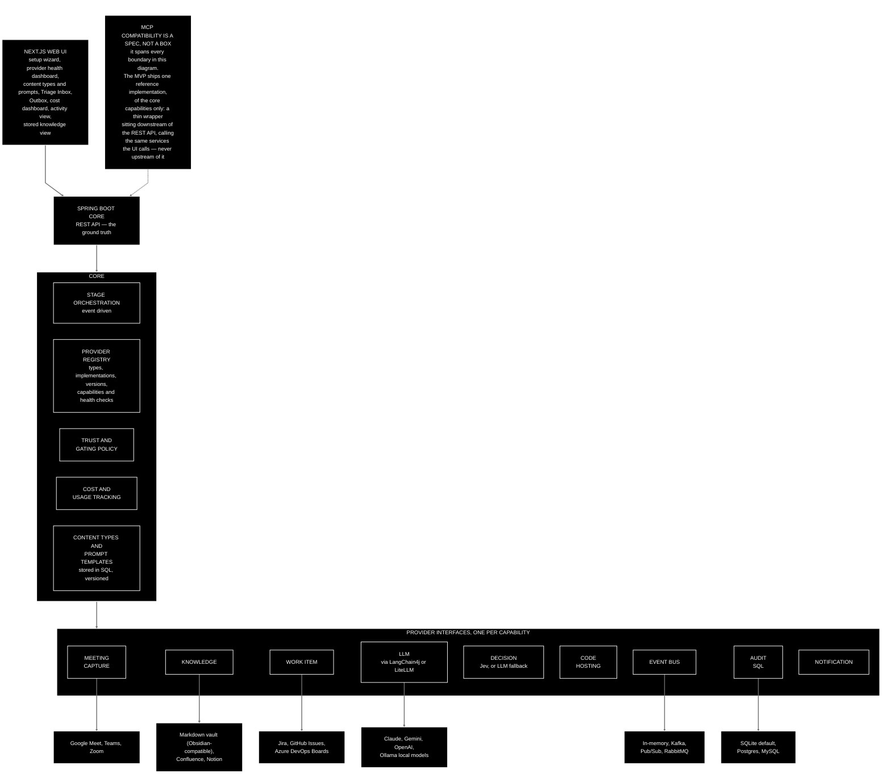

[← Back to the CKA PRD](../../README.md) · Previous: [7. Core concepts and domain model](07-core-concepts-and-domain-model.md)

## 8. Architecture

### 8.1 Overview

A web front end talks to a Java core over a REST API (a standard style of web interface between a front end and a back end). The core orchestrates the three stages and talks to every provider through a common interface, so nothing above the provider layer knows or cares which vendor is underneath.

- **Backend:** Java (latest long-term support, or LTS, release) with Spring Boot (the standard Java application framework). Each provider category is a Java interface; each implementation is a Spring bean (a component Spring creates and wires in for you), selected by configuration through dependency injection (DI) — the mechanism that lets the core ask for "a work item provider" and receive whichever one is configured. The backend does all processing and orchestration, and is the piece that needs to scale in a large organisation.

  **Why one persistent application rather than serverless functions.** A reviewer suggested serverless to cut hosting costs. The core is inherently stateful: it holds state across multi-step provider calls, it subscribes continuously to the event bus, and it coordinates the Outbox retry pattern. That is a poor fit for stateless, bursty functions. And because the core has to run always-on anyway to listen on the bus, splitting it into functions saves nothing while adding network hops, cold starts and operational complexity. Individual stateless provider calls could be moved to functions later; the core stays one application.
- **Front end:** Next.js (a React web framework), talking to the core over the REST API. Hosts the setup wizard, the provider health dashboard, the content-type and prompt editor, Triage Inbox, Outbox, cost dashboard, a stored knowledge view (open the note that was written), and a simple activity view (what was captured, what was stored, what was done — backed by the audit service). In a demo configuration only, it also hosts a reset control (see [Section 14](14-landing-page.md#14-landing-page)).
- **Event-driven core:** stages *and the providers within them* publish and consume events over the event bus provider — "content captured", "content summarised", "knowledge stored", "action proposed", "action applied", "action failed". Every handoff in the pipeline is one of these; there is no direct in-process call from one provider to the next, including from the LLM provider to the knowledge provider. See [7.1](07-core-concepts-and-domain-model.md#71-stages) for who publishes and consumes what. This is what makes the stages composable rather than a hard-coded chain.
- **LLM access:** through an LLM gateway library — LangChain4j on the JVM (Java Virtual Machine — the Java runtime), or LiteLLM as a self-hosted proxy. This supplies the unified API across cloud and local models and per-call cost calculation; CKA does not reimplement it. Local models (for example via Ollama) are therefore first-class with no extra work.
- **Decision layer — Jev (TypeSafe AI), or an LLM fallback:** a constrained-decision model, not a chat model; it returns a probability, a choice among fixed options or a score, rather than prose. Used for (a) *mention detection*: given the stored knowledge content and a scoped candidate list, a calibrated confidence per candidate; (b) *action classification*: given a trigger-phrase segment, whether a mutating action was requested and with what confidence; (c) optionally, *content-type classification*. Jev's fixed-choice nature is what drove the candidate-pool scoping design: the architecture was shaped around the tool's characteristics rather than bolting the tool on.

  **Jev is optional.** Most people trying the project will not have a TypeSafe key, so the decision provider has a second implementation behind the same interface: the configured LLM provider makes the same decisions, in the same shape, less calibrated.

  **The fallback's shape is the vendor's, not ours.** TypeSafe officially publish [`system-one-adapter-python`](https://github.com/typesafe-ai/system-one-adapter-python), a drop-in LLM-backed replacement for their own `system_one` evaluation API returning a `SystemOneResponse` subclass. That it is *official* is the load-bearing fact: a community lookalike would carry no more authority than one written here, and porting it would buy nothing. CKA's fallback is a **Java port of that adapter**, not an independent lookalike — so the contract the fallback must satisfy is defined upstream. What gets ported is the response shape, the `Noul` / `Score` / `Choice` question types, corrective retries on malformed model output, probability normalisation, and the per-attempt debug and token-usage reporting. A port rather than a sidecar keeps the core one runtime and one process, and keeps every LLM call inside LangChain4j so cost tracking still sees all of them.

  The Jev adapter itself is a thin wrapper written in this codebase that calls the TypeSafe HTTP API directly — TypeSafe ship JavaScript and Python SDKs and a Python LangChain integration, but no *official* Java SDK. Community Java clients appeared within days of Jev's release; they were evaluated and rejected as too immature to depend on (see decision 60). Jev is early access (released 15 September 2026), so its API may still move.
- **Audit service:** a dedicated service that stores its records in a SQL database, on a **shared SQL persistence layer** that prompt storage uses too. **Spring Data JDBC** is the data access layer; **Flyway** supplies versioned schema migrations, checked into the repo alongside the schema they create. SQLite by default (zero setup, a single file); Postgres, MySQL and others by configuration, with the SQL kept dialect-portable so no database-specific type leaks into the domain layer. It is optional *in general*: if no audit store is configured, audit-dependent functionality (trust ramp, history, activity view) is disabled and the UI signposts clearly what is missing and how to enable it. *In the MVP it is always on, and only SQLite is tested.*
- **Event bus provider:** a deliberately simple publish/subscribe interface with implementations for Kafka, Google Pub/Sub and RabbitMQ (all message brokers), plus in-memory for tests. Delivery and ordering semantics beyond the basics are not abstracted; teams that need Kafka-specific guarantees extend the provider themselves. *The MVP runs RabbitMQ as a real broker in Docker Compose, not the in-memory implementation — the decoupling between Knowledge and Action is only worth claiming if it is exercised against a real bus.*
- **MCP compatibility — a spec, not a server.** CKA is MCP-compatible across the whole stack via a published **specification/methodology** (`docs/mcp-spec.md`, linked from the README and the GitHub Pages site), not a single centralised server. (MCP: Model Context Protocol, the open standard by which an AI agent discovers and calls external tools.) The spec covers two things: CKA's own core capabilities — triage, the action decision chain, stored knowledge, provider health, error recovery — and each provider interface (content listener, LLM, knowledge, decision, work item), so a provider can be satisfied by *any* MCP-conformant server rather than only bespoke CKA code. Any component can implement it independently; there is no "the CKA MCP server".

  **A deterministic API is the architectural core, and MCP is a layer on top of it — not the other way around.** The application services behind triage, the audit trail, knowledge and provider status are designed, built and tested as a normal REST/JSON API in their own right; the MCP reference implementation wraps that already-working API afterwards, calling straight through to the same service methods rather than reshaping them. MCP remains the intended **entry point in the sense that matters day to day** — the primary way an AI agent is meant to reach CKA — but that is a usage goal, not a build-order dependency. The REST API is not a thin consumer of MCP-shaped services; the MCP layer is the thin wrapper.

  **Discoverability is a requirement, not an aspiration.** Tool names, descriptions and parameter schemas are held to a bar: a generic MCP client with no CKA-specific knowledge must be able to map an ordinary natural-language request onto the right tool calls from the exposed schema alone, with no bespoke integration. For the MVP, CKA's own reference implementation covers the core capabilities only, built on the official Spring AI MCP Server Boot Starter. Provider-side MCP implementations are specified but not built.
- **Secrets and tokens:** OAuth tokens and provider credentials are held in a secrets provider (local encrypted store by default; cloud secret managers via Terraform). No provider-specific claim, key format or error type may leak into the domain layer. *In the MVP there is no secrets provider: credentials and the Google refresh token live in the `.env` file written by `./setup.sh`. A secrets provider abstraction is deferred and remains an open question ([Section 16](16-17-open-questions-and-next-steps.md#16-open-questions)).*

### 8.2 The LLM's actual jobs

| Job | Input → output | Provider |
|---|---|---|
| Transcription | Audio → text. **Skipped when the capture provider already supplies a transcript** — Google Meet and Microsoft Teams both can — which also removes the cost of this step. *Not built in the MVP at all: Meet always supplies a transcript, so the step never runs for the MVP's reference provider* | LLM / speech-to-text provider (cloud or local) |
| Summarisation | Text → summary, decisions, follow-ups, **using the versioned prompt for the item's content type** ([7.6](07-core-concepts-and-domain-model.md#76-content-types-and-summary-prompts)). For Google Meet the input is the platform transcript **and** the platform summary, used together. The result is published as a **content summarised** event for the knowledge provider to store — the LLM provider does not write to the knowledge store itself. **This is the LLM's whole job in the pipeline — it never extracts work item IDs** | LLM provider |
| Mention detection | Stored knowledge content (transcript and summary) + candidate pool → confidence per item. One step, with **no separate ID-extraction pass** in front of it: the decision provider classifies directly against the pool of real work items | Jev, or the LLM fallback |
| Action classification | Trigger-phrase segment → action requested? + confidence | Jev, or the LLM fallback |
| Content-type classification (optional) | Text → one of the configured content types, when no rule has assigned one | Jev, or the LLM fallback |

Each job can use a different provider and model independently, since they have very different cost and complexity profiles. The dashboard attributes spend per job and, because summarisation prompts are per content type, per content type too.

The split between the last three rows and the second is deliberate and load-bearing. An earlier design had the LLM pull ticket identifiers out of the transcript and the decision provider check them; that meant two components had to agree on what a reference was, and the extraction step could invent identifiers that matched nothing. Mention detection against the real candidate pool is a single step that cannot produce an identifier no work item has — and where a reference genuinely matches nothing, the result is a recorded **unmatched mention** rather than a fabricated action.

---

← Back to the PRD: [README](../../README.md) · Previous: [7. Core concepts and domain model](07-core-concepts-and-domain-model.md) · Next: [9. Trust, safety and audit](09-trust-safety-and-audit.md) →
