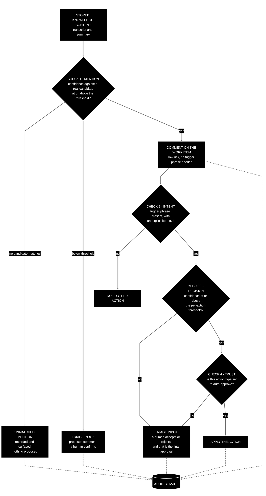

[← Back to the CKA PRD](../../README.md) · Previous: [8. Architecture](08-architecture.md)

## 9. Trust, safety and audit

### 9.1 The gate model

Two generic terms are used throughout. An **action check** is a single check in this chain — mention, intent, decision, trust. An **action threshold** is the value a confidence score is compared against at an action check. The four checks:

- **Check 1 — mention.** The decision provider's confidence that a candidate work item was mentioned, compared against the mention threshold (default 90%). Three outcomes, and no fourth: at or above the threshold, CKA comments on the item automatically — a comment changes nothing, so no trigger phrase and no approval are required; below the threshold, the comment is **proposed in the Triage Inbox** for a human to confirm rather than discarded; and where the reference matches no candidate in the pool at all, it is recorded as an **unmatched mention**.
- **Check 2 — intent.** The team trigger phrase is present and names the item by its ID in the same sentence. Only segments passing this check are ever considered for mutating actions.
- **Check 3 — decision.** The decision provider's confidence that the requested action is what was asked is at or above the per-action-type threshold.
- **Check 4 — trust.** The action type's trust setting is auto-approve; otherwise the proposal goes to the Triage Inbox.

**What the Triage Inbox holds.** Two different kinds of proposal, which look similar and mean very different things. A **proposed comment** is a low-confidence mention: CKA thinks an item may have been discussed but is not sure enough to say so on the item itself. Accepting it posts a comment; rejecting it posts nothing. A **proposed action** is a mutating change — close, transition, assign — and always carries more weight. Both are shown with their confidence, the excerpt they came from, and the provider and model that produced them, so the two are distinguishable at a glance.

**Unmatched mentions.** Check 1 classifies against the pool of *real* candidate work items, so a reference that corresponds to nothing in the pool cannot produce an action. Rather than disappearing, it is recorded as an **unmatched mention**: written to the action decision chain and shown in the front end as its own state, not as a triage proposal — there is nothing for a human to accept, because there is no item to act on. This is deliberately distinct from both a low-confidence mention, which *does* have a candidate and therefore can be proposed, and a rejected proposal, which was a real — if wrong — match that a human turned down. The three say, in order: "something was said that we could not tie to any work item"; "we think this item was discussed, but we would like you to confirm"; and "we tied it to an item, and the human disagreed". All three are visible; none is silently dropped.

**A human accept in the Triage Inbox is the final approval.** There is no second confirmation dialog after it. One clear approval point, deliberately, rather than a habit-forming double prompt that trains people to click through.

### 9.2 Trust scores

- Per action type (comment, transition, close, assign, ...), never global. A reasonable global default set exists; each type is individually configurable with minimal effort.
- Proposed defaults: comment — automatic; transition, close, assign — review.
- Computed from human approve/reject decisions over a configurable window. Drives both the "switch to auto-approve" suggestion and the "disable, or switch provider" suggestion.

### 9.3 Audit

- Every action — automatic or human-approved — is recorded with provider, model, confidence, decider, **the prompt version that produced the summary it came from**, and outcome.
- The unit of record is the **action decision chain** (see [7.8](07-core-concepts-and-domain-model.md#78-audit-record)): the full traceable path from the original captured content through knowledge storage, mention detection (unmatched mentions included), comments, proposals, the human accept or reject, and the applied action, to the outcome or error. Any applied or rejected action can be traced back to the recording it came from.
- The audit trail is the basis for the trust ramp, the activity view and post-hoc investigation ("why did it close that?").
- It lives in the audit service, not in any third-party platform, so an unavailable knowledge or work item provider cannot take accountability down with it.

---

← Back to the PRD: [README](../../README.md) · Previous: [8. Architecture](08-architecture.md) · Next: [10. Extensibility](10-extensibility.md) →
