[← Back to the CKA PRD](../README.md)

## 7. Core concepts and domain model

### 7.1 Stages

Capture, Knowledge and Action are independently invokable stages connected by events. Each stage produces a normalised output the next stage can consume regardless of what fed it: Capture produces "content + text, with a content type" (whether from a recording with or without a platform transcript, or from a document); Knowledge produces "stored, linkable knowledge"; Action produces "proposed or applied actions". This is what makes J1, J2 and J3 all valid without special-casing.

```mermaid
---
title: The three stages, and how content flows through them
---
%%{init: {"theme":"base","themeVariables":{"background":"#000000","fontSize":"20px","fontFamily":"Helvetica, Arial, sans-serif","primaryColor":"#000000","primaryTextColor":"#ffffff","primaryBorderColor":"#ffffff","secondaryColor":"#000000","secondaryTextColor":"#ffffff","secondaryBorderColor":"#ffffff","tertiaryColor":"#000000","tertiaryTextColor":"#ffffff","tertiaryBorderColor":"#ffffff","lineColor":"#ffffff","textColor":"#ffffff","mainBkg":"#000000","nodeBorder":"#ffffff","nodeTextColor":"#ffffff","clusterBkg":"#000000","clusterBorder":"#ffffff","titleColor":"#ffffff","edgeLabelBackground":"#000000"},"flowchart":{"nodeSpacing":80,"rankSpacing":110,"padding":30,"curve":"linear"}}}%%
flowchart LR
  subgraph CAP["1 · CAPTURE"]
    direction TB
    MC["MEETING CAPTURE PROVIDER<br/>recording, plus transcript<br/>if the platform provides one"]
    DU["DOCUMENT CAPTURE<br/>an upload, or pages already<br/>in the knowledge provider"]
  end
  subgraph KNO["2 · KNOWLEDGE"]
    direction TB
    TYPE["ASSIGN CONTENT TYPE<br/>meeting type or document type,<br/>by rule, by hand, or by Jev"]
    LLM["LLM PROVIDER<br/>transcribe only if no transcript,<br/>then summarise with the<br/>content-type prompt"]
    KP["KNOWLEDGE PROVIDER<br/>offline Markdown vault, Confluence,<br/>Notion: store, link and index"]
  end
  subgraph ACT["3 · ACTION"]
    direction TB
    DET["JEV: MENTION DETECTION<br/>confidence per item in the<br/>scoped candidate pool"]
    GATE["GATES<br/>trigger phrase, decision<br/>confidence, trust setting"]
    WI["WORK ITEM PROVIDER<br/>Jira, Azure DevOps, GitHub Issues:<br/>comment, or apply the approved action"]
  end
  MC ==> TYPE
  DU ==> TYPE
  TYPE ==> LLM ==> KP ==> DET ==> GATE ==> WI
  AUD[("AUDIT SERVICE (SQL)<br/>every step recorded with<br/>provider, model and decider")]
  KP -.-> AUD
  GATE -.-> AUD
  WI -.-> AUD
  classDef default fill:#000000,stroke:#ffffff,stroke-width:2px,color:#ffffff
  style CAP fill:#000000,stroke:#ffffff,stroke-width:3px,color:#ffffff
  style KNO fill:#000000,stroke:#ffffff,stroke-width:3px,color:#ffffff
  style ACT fill:#000000,stroke:#ffffff,stroke-width:3px,color:#ffffff
  linkStyle default stroke:#ffffff,stroke-width:3px
```

### 7.2 Providers

| Category | Capability | Initial reference implementations | Role |
|---|---|---|---|
| Meeting capture | Detect and fetch new recordings and, where the platform provides them, transcripts | Google Meet (via Drive), Microsoft Teams, Zoom | Golden path |
| Knowledge | Store, link and index knowledge. An offline, LLM-readable store is a first-class option, not a fallback | Local Markdown vault (Obsidian-compatible; see 7.3), Confluence, Notion | Golden path |
| Work item | Query, comment, transition, create | Jira, GitHub Issues, Azure DevOps (Boards) | Golden path |
| LLM | Transcribe, summarise, extract | Claude, Gemini, OpenAI, local via Ollama (a tool for running models on your own machine) — all through LangChain4j / LiteLLM | Golden path |
| Decision | Calibrated classification and scoring | Jev (TypeSafe AI) | Golden path |
| Code hosting | Pipelines and repository access, for future code-oriented providers | GitHub, Bitbucket, GitLab | Supporting |
| Event bus | Publish and subscribe | In-memory (local), Kafka, Google Pub/Sub, RabbitMQ | Supporting |
| Audit store | SQL persistence | SQLite (default), Postgres, MySQL | Supporting |
| Notification | Alert humans | Email, Slack | Supporting |
| Cloud | Hosting via Terraform (an infrastructure-as-code tool) | Google Cloud (GCP), Amazon Web Services (AWS), Microsoft Azure | Supporting |

"Supporting" providers are first-class in the interface sense — fully swappable — but infrastructural in role rather than part of the visible user journey. Provider *types* are themselves registrable, not a fixed enumeration: a developer can add a new implementation of an existing type (a new work item provider) or an entirely new type (an "agent" or "code generation" provider) without modifying the core.

### 7.3 The offline knowledge store

The first-class offline option for the Knowledge stage is a **Markdown vault**: a plain folder of Markdown text files on a disk you control. Each captured item becomes one file; links between items are ordinary text links; the folder can live on a laptop, a shared drive or a server, be versioned with git, and be backed up like any other files. There is no database and no vendor account. The whole knowledge base can be read with nothing more than a text editor — and, because it is plain text with explicit links, it is the most directly LLM-readable store there is: CKA's own search and indexing, and any retrieval index built on top of it (see [Open questions](16-17-open-questions-and-next-steps.md#16-open-questions)), read straight from the files.

**What Obsidian is.** Obsidian is a widely used knowledge-base application that works on top of exactly this kind of folder. It reads and writes plain Markdown files; adds wiki-style links between notes (written as double square brackets around the note's name), tags, search, and an interactive graph showing how notes connect; and runs entirely on the user's own machine — desktop and mobile — with no account required. It is free for both personal and commercial use; its optional paid services are cloud sync and web publishing, and neither is needed for CKA. Obsidian itself is a single-user editor rather than a collaboration tool, so a team shares a vault through git or shared storage, which is how CKA keeps the vault in sync anyway.

**What "Obsidian-compatible" means.** CKA writes the vault in the conventions Obsidian understands: one Markdown file per captured item, double-square-bracket links between items, tags in the text or in a small metadata block at the top of each file, and attachments in a sub-folder. The result is that a team can open the folder in Obsidian and browse, search and edit its knowledge base through a polished interface with a graph of how everything connects — while anyone without Obsidian can still read every file in any editor, and any LLM can read the vault directly. Obsidian is not a dependency: CKA never requires it to be installed, and the vault is fully useful without it. It is offered as a first-class option because it gives a local, private, LLM-readable wiki a good human interface at no cost.

### 7.4 Trigger phrase

A configurable, canonical team phrase that marks a spoken instruction as deliberate — the equivalent of a wake word. It is required for any mutating action and must be accompanied by an explicit work item ID in the same sentence. It is never required for passive mentions, which only ever produce comments. Individual users may optionally set their own phrase; the canonical team phrase is the expected configuration.

### 7.5 Candidate pool

The set of work items Jev classifies against. It is scoped *before* classification so the choice space stays small (a few hundred to around a thousand items) and the confidences stay meaningful. Options: current sprint; items on the team's board modified within N days; open items in a project; optionally including To Do. Configurable per team. Items outside the pool will not be detected — a deliberate trade for precision and cost, and one the wizard and documentation state plainly.

### 7.6 Content types and summary prompts

Captured content is not always a meeting: it may be a recording, a page that already exists in the knowledge provider, or an uploaded document. So the thing that decides how an item is summarised is its **content type**, and every captured item is given one. Each content type has its own **summary prompt** — the instructions given to the LLM when it summarises content of that type.

Two built-in families of content type, plus a fallback:

- **Meeting types.** The starting set, chosen for example purposes, is stand-up, ticket refinement, sprint planning and retrospective. A good stand-up summary (who is blocked, what changed since yesterday) looks nothing like a good refinement summary (which items were discussed, what estimates or acceptance criteria changed, what was deferred).
- **Document types.** For content that is not a meeting — decision records, design notes, incident write-ups, or anything else a team wants summarised in a particular shape. Teams define their own.
- **General.** The fallback prompt for any item that has not been given a more specific type.

How types and prompts behave:

- CKA ships with sensible default prompts for the starting meeting types and the general fallback. Every prompt is plain text, editable in the UI, stored in configuration alongside the rest of the setup, and versioned so a change can be reviewed and rolled back.
- Teams add their own meeting and document types, each with its own prompt, without writing code.
- A type is assigned by rules — a match on the calendar title or the meeting's recurrence, a naming convention the wizard helps set up, or for documents the location or label of the source page — or chosen manually after capture. Optionally, the decision provider (Jev) can classify the type from the text, since "choose one of these fixed types" is exactly the kind of decision it makes well.
- The type can also shape what the Action stage looks for: a refinement session is a likelier source of estimate or status changes than a one-to-one.
- **When no type can be assigned**, the item is summarised with the general prompt, and the stored page and the activity view carry a clear call to action: assign one of the existing types, or create a new type with its own prompt. Either choice re-runs the summary. A wrong type produces a summary shaped for the wrong kind of content — never a wrong action — and is corrected the same way.

### 7.7 Actions, gates and trust

See [Section 9](09-trust-safety-and-audit.md#9-trust-safety-and-audit).

### 7.8 Audit record

What happened, when, on which content, proposed by which provider and model with what confidence, decided by whom (system or named human), with what outcome, and the error if any.

---

← Back to the PRD: [README](../README.md) · Next: [8. Architecture](08-architecture.md) →
