[← Back to the CKA PRD](../README.md)

## 7. Core concepts and domain model

### 7.1 Stages

Capture, Knowledge and Action are independently invokable stages connected by events. Each stage produces a normalised output the next stage can consume regardless of what fed it: Capture produces "content + text, with a content type" (whether from a recording with or without a platform transcript, or from a document); Knowledge produces "stored, linkable knowledge"; Action produces "proposed or applied actions". This is what makes J1, J2 and J3 all valid without special-casing.

**The stages communicate only through events on the bus — they never call each other directly.** Nor do the providers within a stage. Every handoff in the pipeline is an event:

| Event | Published by | Consumed by |
|---|---|---|
| **content captured** | the capture provider's content listener | the LLM provider |
| **content summarised** | the LLM provider, once it has summarised (and transcribed first, if the platform supplied no transcript) | the knowledge provider |
| **knowledge stored** | the knowledge provider, once the write completes | the Action stage |
| **action proposed**, **action applied**, **action failed** | the Action stage | the audit service, the front end |

Nothing in the Action stage is invoked by the orchestrator or by the LLM step, and the LLM provider never hands its output to the knowledge provider directly — it announces that it has finished, and the knowledge provider picks the work up. This is the mechanism behind the composability claim rather than a restatement of it: any stage, and any provider within one, can be replaced, run alone, or driven by something else entirely, because none holds a reference to the next.

```mermaid
---
title: The three stages, and how content flows through them
---
%%{init: {"theme":"base","themeVariables":{"background":"#000000","fontSize":"20px","primaryColor":"#000000","primaryTextColor":"#ffffff","primaryBorderColor":"#ffffff","secondaryColor":"#000000","secondaryTextColor":"#ffffff","secondaryBorderColor":"#ffffff","tertiaryColor":"#000000","tertiaryTextColor":"#ffffff","tertiaryBorderColor":"#ffffff","lineColor":"#6e6e6e","textColor":"#ffffff","mainBkg":"#000000","nodeBorder":"#ffffff","nodeTextColor":"#ffffff","clusterBkg":"#000000","clusterBorder":"#ffffff","titleColor":"#6e6e6e","edgeLabelBackground":"#000000"},"flowchart":{"nodeSpacing":80,"rankSpacing":110,"padding":30,"curve":"linear"},"themeCSS":"svg{background:#000000 !important;}"}}%%
flowchart LR
  subgraph CAP["1 · CAPTURE"]
    direction TB
    MC["MEETING CAPTURE PROVIDER<br/>recording, plus transcript<br/>if the platform provides one"]
    DU["DOCUMENT CAPTURE<br/>an upload, or pages already<br/>in the knowledge provider"]
  end
  subgraph KNO["2 · KNOWLEDGE"]
    direction TB
    TYPE["ASSIGN CONTENT TYPE<br/>meeting type or document type,<br/>by rule, by hand, or by Jev"]
    LLM["LLM PROVIDER<br/>transcribe only if no transcript,<br/>then summarise with the<br/>content-type prompt"]
    KP["KNOWLEDGE PROVIDER<br/>offline Markdown vault, Confluence,<br/>Notion: store, link and index"]
  end
  subgraph ACT["3 · ACTION"]
    direction TB
    DET["JEV: MENTION DETECTION<br/>confidence per item in the<br/>scoped candidate pool"]
    GATE["ACTION CHECKS<br/>mention, intent, decision, trust,<br/>each against its threshold"]
    WI["WORK ITEM PROVIDER<br/>Jira, Azure DevOps, GitHub Issues:<br/>comment, or apply the approved action"]
  end
  B1{{"EVENT BUS<br/>content captured"}}
  B2{{"EVENT BUS<br/>content summarised"}}
  B3{{"EVENT BUS<br/>knowledge stored"}}
  MC ==> TYPE
  DU ==> TYPE
  TYPE ==> B1 ==> LLM ==> B2 ==> KP ==> B3 ==> DET ==> GATE ==> WI
  AUD[("AUDIT SERVICE (SQL)<br/>every step recorded with<br/>provider, model and decider")]
  KP -.-> AUD
  GATE -.-> AUD
  WI -.-> AUD
  classDef default fill:#000000,stroke:#ffffff,stroke-width:2px,color:#ffffff
  style CAP fill:#000000,stroke:#ffffff,stroke-width:3px,color:#ffffff
  style KNO fill:#000000,stroke:#ffffff,stroke-width:3px,color:#ffffff
  style ACT fill:#000000,stroke:#ffffff,stroke-width:3px,color:#ffffff
  linkStyle default stroke:#6e6e6e,stroke-width:3px
```

### 7.2 Providers

| Category | Capability | Initial reference implementations | Role |
|---|---|---|---|
| Meeting capture | Detect and fetch new recordings and, where the platform provides them, transcripts and summaries. The interface is a **content listener**; the implementation for folder-based sources is a **folder watcher**, which polls the folder on an interval. Other implementations, such as a webhook receiver, are possible | Google Meet (via Drive) — the MVP reference implementation — Microsoft Teams, Zoom | Golden path |
| Knowledge | Store, link and index knowledge. An offline, LLM-readable store is a first-class option, not a fallback. Subscribes to **content summarised** and publishes **knowledge stored** when the write completes — it is not called by the LLM provider | Local Markdown vault (Obsidian-compatible; see 7.3) — the MVP reference implementation — Confluence, Notion | Golden path |
| Work item | Query, comment, transition, create. Each implementation ships a **work item mapper** (see 7.9) converting between the provider's native concept and the generic core work item, wired by Spring DI | GitHub Issues — the MVP reference implementation — Jira, Azure DevOps (Boards) | Golden path |
| LLM | Transcribe and summarise. Subscribes to **content captured** and publishes **content summarised** — it does not write to the knowledge provider itself. It does **not** extract work item IDs either; that is the decision provider's job (see 8.2) | Claude, Gemini, OpenAI, local via Ollama (a tool for running models on your own machine) — all through LangChain4j / LiteLLM | Golden path |
| Decision | Calibrated classification and scoring | Two implementations: **Jev (TypeSafe AI)**, and an **LLM-based fallback** used when no Jev key is configured — same interface, less calibrated. The Jev adapter is a thin wrapper written in this codebase calling the TypeSafe API directly, because no Java SDK was found and the LangChain integration is Python | Golden path |
| Code hosting | Pipelines and repository access, for future code-oriented providers | GitHub, Bitbucket, GitLab | Supporting |
| Event bus | Publish and subscribe | **RabbitMQ** — the MVP reference implementation, a real broker running in Docker Compose — Kafka, Google Pub/Sub; in-memory for tests | Supporting |
| Audit store | SQL persistence | SQLite (default), Postgres, MySQL | Supporting |
| Notification | Alert humans | Email, Slack | Supporting |
| Cloud | Hosting via Terraform (an infrastructure-as-code tool) | Google Cloud (GCP) — the target host for the public demo — Amazon Web Services (AWS), Microsoft Azure | Supporting |

**Every provider exposes a connection/health check.** It is a required operation on each interface, not an optional extra, and it is what the front end's provider status view and the wizard's connection tester are built on.

"Supporting" providers are first-class in the interface sense — fully swappable — but infrastructural in role rather than part of the visible user journey. Provider *types* are themselves registrable, not a fixed enumeration: a developer can add a new implementation of an existing type (a new work item provider) or an entirely new type (an "agent" or "code generation" provider) without modifying the core.

RabbitMQ was chosen as the MVP's broker because it is the simplest of the three candidates to stand up locally: a single container, with no coordinator or cluster service to run alongside it as Kafka needs, and well-supported by Spring AMQP.

### 7.3 The offline knowledge store

The first-class offline option for the Knowledge stage is a **Markdown vault**: a plain folder of Markdown text files on a disk you control. Each captured item becomes one file; links between items are ordinary text links; the folder can live on a laptop, a shared drive or a server, be versioned with git, and be backed up like any other files. There is no database and no vendor account. The whole knowledge base can be read with nothing more than a text editor — and, because it is plain text with explicit links, it is the most directly LLM-readable store there is: CKA's own search and indexing, and any retrieval index built on top of it (see [Open questions](16-17-open-questions-and-next-steps.md#16-open-questions)), read straight from the files.

**What Obsidian is.** Obsidian is a widely used knowledge-base application that works on top of exactly this kind of folder. It reads and writes plain Markdown files; adds wiki-style links between notes (written as double square brackets around the note's name), tags, search, and an interactive graph showing how notes connect; and runs entirely on the user's own machine — desktop and mobile — with no account required. It is free for both personal and commercial use; its optional paid services are cloud sync and web publishing, and neither is needed for CKA. Obsidian itself is a single-user editor rather than a collaboration tool, so a team shares a vault through git or shared storage, which is how CKA keeps the vault in sync anyway.

**What "Obsidian-compatible" means.** CKA writes the vault in the conventions Obsidian understands: one Markdown file per captured item, double-square-bracket links between items, tags in the text or in a small metadata block at the top of each file, and attachments in a sub-folder. The result is that a team can open the folder in Obsidian and browse, search and edit its knowledge base through a polished interface with a graph of how everything connects — while anyone without Obsidian can still read every file in any editor, and any LLM can read the vault directly. Obsidian is not a dependency: CKA never requires it to be installed, and the vault is fully useful without it. It is offered as a first-class option because it gives a local, private, LLM-readable wiki a good human interface at no cost.

### 7.4 Trigger phrase

A configurable, canonical team phrase that marks a spoken instruction as deliberate — the equivalent of a wake word. **"Trigger phrase" is the canonical term** throughout this document, the codebase and the configuration; "wake word" and "wake phrase" appear only as plain-language glosses when explaining it to someone for the first time, never as identifiers. It is required for any mutating action and must be accompanied by an explicit work item ID in the same sentence. It is never required for passive mentions, which only ever produce comments. Individual users may optionally set their own phrase; the canonical team phrase is the expected configuration. *In the MVP it is set through an env var, asked for by `./setup.sh`.*

### 7.5 Candidate pool

The set of work items Jev classifies against. It is scoped *before* classification so the choice space stays small (a few hundred to around a thousand items) and the confidences stay meaningful. Options: current sprint; items on the team's board modified within N days; open items in a project; optionally including To Do. Configurable per team. Items outside the pool will not be detected — a deliberate trade for precision and cost, and one the wizard and documentation state plainly.

Scoring against the pool has three possible outcomes (see [9.1](09-trust-safety-and-audit.md#91-the-gate-model)): a candidate at or above the mention threshold is commented on automatically; a candidate below it is proposed as a comment in the Triage Inbox for a human to confirm; and a reference matching **no** candidate at all is recorded as an **unmatched mention** — no proposal, but written to the action decision chain and surfaced in the front end rather than dropped without trace. Nothing the decision provider sees is discarded silently.

*MVP scope for GitHub: all issues in the configured repository, with no filtering. The scoping options above are the general design; the MVP exercises the simplest possible pool.*

### 7.6 Content types and summary prompts

Captured content is not always a meeting: it may be a recording, a page that already exists in the knowledge provider, or an uploaded document. So the thing that decides how an item is summarised is its **content type**, and every captured item is given one. Each content type has its own **summary prompt** — the instructions given to the LLM when it summarises content of that type.

Two built-in families of content type, plus a fallback:

- **Meeting types.** The starting set, chosen for example purposes, is stand-up, ticket refinement, sprint planning and retrospective. A good stand-up summary (who is blocked, what changed since yesterday) looks nothing like a good refinement summary (which items were discussed, what estimates or acceptance criteria changed, what was deferred).
- **Document types.** For content that is not a meeting — decision records, design notes, incident write-ups, or anything else a team wants summarised in a particular shape. Teams define their own.
- **General.** The fallback prompt for any item that has not been given a more specific type.

How types and prompts behave:

- CKA ships with sensible default prompts for the starting meeting types and the general fallback. Every prompt is plain text and editable in the UI.
- **Prompts are first-class data in SQL, not configuration.** They are keyed by content type and versioned: every change creates a new version; the current active version is fetched at capture time; and the version used is recorded against each output, so the audit trail can say which prompt version produced which summary. Endpoints to list, create and version prompts, and a front-end prompt editor, are **in the MVP** — not deferred.
- Teams add their own meeting and document types, each with its own prompt, without writing code.
- *The MVP ships a single meeting type ("Sprint Refinement") with the full mechanism in place behind it: the type-to-prompt mapping is real and extensible, simply exercised with one type.*
- A type is assigned by rules — a match on the calendar title or the meeting's recurrence, a naming convention the wizard helps set up, or for documents the location or label of the source page — or chosen manually after capture. Optionally, the decision provider (Jev) can classify the type from the text, since "choose one of these fixed types" is exactly the kind of decision it makes well.
- The type can also shape what the Action stage looks for: a refinement session is a likelier source of estimate or status changes than a one-to-one.
- **When no type can be assigned**, the item is summarised with the general prompt, and the stored page and the activity view carry a clear call to action: assign one of the existing types, or create a new type with its own prompt. Either choice re-runs the summary. A wrong type produces a summary shaped for the wrong kind of content — never a wrong action — and is corrected the same way.

### 7.7 Actions, gates and trust

See [Section 9](09-trust-safety-and-audit.md#9-trust-safety-and-audit).

### 7.8 Audit record

What happened, when, on which content, proposed by which provider and model with what confidence, **using which prompt version**, decided by whom (system or named human), with what outcome, and the error if any.

Individual records are not the unit that matters. The **action decision chain** is: the full traceable record from the original captured content — through knowledge storage, mention detection (including unmatched mentions), comments, proposals, the human accept or reject, and the applied action — to whatever outcome or error resulted. Any action can be traced back to the recording it came from, and any recording forward to everything it caused.

### 7.9 Work item model

The core has its own generic work item, and no provider's concept reaches past the provider layer.

- **Work item mapper.** Each work item provider ships one implementation, wired by Spring DI, which converts between the provider's native concept and the generic core work item in both directions. It is a named extension point (see [Section 10](10-extensibility.md#10-extensibility)), not an implementation detail: adding a work item provider means writing its mapper.
- **Nested work items.** The model supports parent/child relationships, generalising Jira epics and their children, Azure DevOps Boards hierarchy, and GitHub sub-issues.
- **Provider work item type name.** A string on the work item holding the provider's *own* type label — "Epic", "Story", "Bug", "Sub-issue" — kept deliberately distinct from the generic type. This is what stops the model forcing a false equivalence: a Jira Epic and a GitHub milestone are not the same thing, and the core does not pretend they are. It carries both the generic type it can reason about and the provider's label it must not lose.

---

← Back to the PRD: [README](../README.md) · Next: [8. Architecture](08-architecture.md) →
