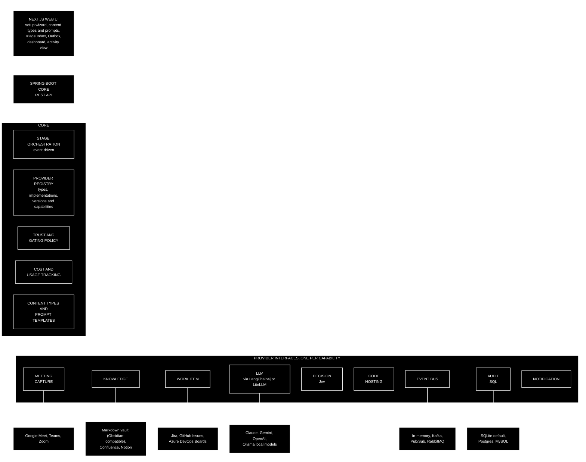

[← Back to the CKA PRD](../README.md) · Previous: [7. Core concepts and domain model](07-core-concepts-and-domain-model.md)

## 8. Architecture

### 8.1 Overview

A web front end talks to a Java core over a REST API (a standard style of web interface between a front end and a back end). The core orchestrates the three stages and talks to every provider through a common interface, so nothing above the provider layer knows or cares which vendor is underneath.

- **Backend:** Java (latest long-term support, or LTS, release) with Spring Boot (the standard Java application framework). Each provider category is a Java interface; each implementation is a Spring bean (a component Spring creates and wires in for you), selected by configuration through dependency injection (DI) — the mechanism that lets the core ask for "a work item provider" and receive whichever one is configured. The backend does all processing and orchestration, and is the piece that needs to scale in a large organisation.
- **Front end:** Next.js (a React web framework), talking to the core over the REST API. Hosts the setup wizard, content-type and prompt editor, Triage Inbox, Outbox, cost dashboard, and a simple activity and knowledge view (what was captured, what was stored, what was done — backed by the audit service).
- **Event-driven core:** stages publish and consume events ("content captured", "knowledge stored", "action proposed", "action applied", "action failed") over the event bus provider. This is what makes the stages composable rather than a hard-coded chain.
- **LLM access:** through an LLM gateway library — LangChain4j on the JVM (Java Virtual Machine — the Java runtime), or LiteLLM as a self-hosted proxy. This supplies the unified API across cloud and local models and per-call cost calculation; CKA does not reimplement it. Local models (for example via Ollama) are therefore first-class with no extra work.
- **Decision layer — Jev (TypeSafe AI):** a constrained-decision model, not a chat model; it returns a probability, a choice among fixed options or a score, rather than prose. Used for (a) *mention detection*: given a transcript and a scoped candidate list, a calibrated confidence per candidate; (b) *action classification*: given a trigger-phrase segment, whether a mutating action was requested and with what confidence; (c) optionally, *content-type classification*. Jev's fixed-choice nature is what drove the candidate-pool scoping design: the architecture was shaped around the tool's characteristics rather than bolting the tool on.
- **Audit service:** a dedicated service that stores its records in a SQL database through a pluggable SQL provider. SQLite by default (zero setup); Postgres, MySQL and others by configuration. It is optional: if no audit store is configured, audit-dependent functionality (trust ramp, history, activity view) is disabled and the UI signposts clearly what is missing and how to enable it.
- **Event bus provider:** a deliberately simple publish/subscribe interface with implementations for Kafka, Google Pub/Sub and RabbitMQ (all message brokers), plus in-memory for local runs. Delivery and ordering semantics beyond the basics are not abstracted; teams that need Kafka-specific guarantees extend the provider themselves.
- **Secrets and tokens:** OAuth tokens and provider credentials are held in a secrets provider (local encrypted store by default; cloud secret managers via Terraform). No provider-specific claim, key format or error type may leak into the domain layer.

### 8.2 The LLM's actual jobs

| Job | Input → output | Provider |
|---|---|---|
| Transcription | Audio → text. **Skipped when the capture provider already supplies a transcript** — Google Meet and Microsoft Teams both can — which also removes the cost of this step | LLM / speech-to-text provider (cloud or local) |
| Summarisation | Text → summary, decisions, follow-ups, **using the prompt template for the item's content type** ([7.6](07-core-concepts-and-domain-model.md#76-content-types-and-summary-prompts)) | LLM provider |
| Mention detection | Text + candidate pool → confidence per item | Jev |
| Action classification | Trigger-phrase segment → action requested? + confidence | Jev |
| Content-type classification (optional) | Text → one of the configured content types, when no rule has assigned one | Jev |

Each job can use a different provider and model independently, since they have very different cost and complexity profiles. The dashboard attributes spend per job and, because summarisation prompts are per content type, per content type too.

---

← Back to the PRD: [README](../README.md) · Previous: [7. Core concepts and domain model](07-core-concepts-and-domain-model.md) · Next: [9. Trust, safety and audit](09-trust-safety-and-audit.md) →
