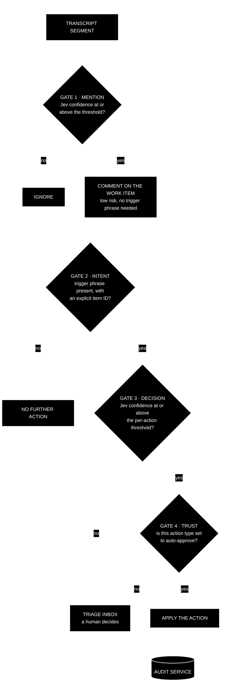

[← Back to the CKA PRD](../README.md) · Previous: [8. Architecture](08-architecture.md)

## 9. Trust, safety and audit

### 9.1 The gate model

- **Gate 1 — mention.** Jev confidence that a candidate work item was mentioned is at or above the mention threshold (default 90%). Outcome: a comment. No trigger phrase required.
- **Gate 2 — intent.** The team trigger phrase is present and names the item by its ID in the same sentence. Only segments passing this gate are ever considered for mutating actions.
- **Gate 3 — decision.** Jev confidence that the requested action is what was asked is at or above the per-action-type threshold.
- **Gate 4 — trust.** The action type's trust setting is auto-approve; otherwise the proposal goes to the Triage Inbox.

### 9.2 Trust scores

- Per action type (comment, transition, close, assign, ...), never global. A reasonable global default set exists; each type is individually configurable with minimal effort.
- Proposed defaults: comment — automatic; transition, close, assign — review.
- Computed from human approve/reject decisions over a configurable window. Drives both the "switch to auto-approve" suggestion and the "disable, or switch provider" suggestion.

### 9.3 Audit

- Every action — automatic or human-approved — is recorded with provider, model, confidence, decider and outcome.
- The audit trail is the basis for the trust ramp, the activity view and post-hoc investigation ("why did it close that?").
- It lives in the audit service, not in any third-party platform, so an unavailable knowledge or work item provider cannot take accountability down with it.

---

← Back to the PRD: [README](../README.md) · Previous: [8. Architecture](08-architecture.md) · Next: [10. Extensibility](10-extensibility.md) →
